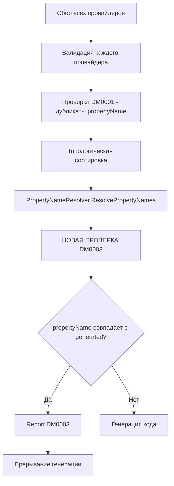

# План реализации DM0003: Property Name Conflicts With Generated Names

## Обзор

Диагностика DM0003 обнаруживает конфликт между пользовательским именем свойства в `[SingletonDIProvide]` и автоматически сгенерированными именами свойств других синглтонов.

## Анализ текущей архитектуры

### Ключевые файлы

| Файл | Назначение |
|------|------------|
| [`DiagnosticDescriptors.cs`](src/SingletonDI.Generator/DiagnosticDescriptors.cs) | Определение всех DiagnosticDescriptor |
| [`SingletonDIGenerator.cs`](src/SingletonDI.Generator/SingletonDIGenerator.cs:112) | Проверка DM0001 после валидации провайдеров |
| [`PropertyNameResolver.cs`](src/SingletonDI.Generator/Helpers/PropertyNameResolver.cs) | Генерация имён свойств |
| [`ProviderValidator.cs`](src/SingletonDI.Generator/Validators/ProviderValidator.cs) | Валидация отдельных провайдеров |

### Формирование имён свойств

```
Без конфликта ShortName:
  DatabaseService → DatabaseServiceInstance

С конфликтом ShortName (два класса с одинаковым именем в разных namespace):
  Foo.Bar.DatabaseService → Foo_Bar_DatabaseServiceInstance
  Baz.Bar.DatabaseService → Baz_Bar_DatabaseServiceInstance
```

### Проблема

Валидация в [`ProviderValidator.Validate()`](src/SingletonDI.Generator/Validators/ProviderValidator.cs:18) происходит для каждого провайдера отдельно, без доступа к списку всех провайдеров. Поэтому проверку DM0003 нужно добавлять в [`SingletonDIGenerator.cs`](src/SingletonDI.Generator/SingletonDIGenerator.cs) после вызова `PropertyNameResolver.ResolvePropertyNames()`.

---

## Детальный план реализации

### 1. DiagnosticDescriptors.cs — добавить DM0003

**Место:** После DM0002 (строка 32)

```csharp
/// <summary>
/// DM0003: Property name conflicts with auto-generated property name.
/// </summary>
public static readonly DiagnosticDescriptor PropertyNameConflictsWithGenerated = Create(
    "DM0003",
    "Property name conflicts with generated name",
    "Property name '{0}' in [SingletonDIProvide] conflicts with auto-generated property name of provider '{1}'. " +
    "Use a different property name to avoid ambiguity.",
    Category,
    DiagnosticSeverity.Error);
```

### 2. SingletonDIGenerator.cs — добавить проверку

**Место:** После строки 155 (`var propertyNames = PropertyNameResolver.ResolvePropertyNames(providerModels);`)

**Логика:**
1. Для каждого провайдера с custom `propertyName`
2. Проверить, совпадает ли оно с любым сгенерированным именем в `propertyNames`
3. Если совпадение найдено — сообщить об ошибке DM0003

```csharp
// Check for custom property names conflicting with generated names (DM0003)
foreach (var provider in providerModels)
{
    if (provider.PropertyName != null)
    {
        // Check against ALL generated property names (including self)
        foreach (var kvp in propertyNames)
        {
            if (kvp.Value == provider.PropertyName)
            {
                // Find the conflicting provider
                var conflictingProvider = providerModels.First(p => p.FullyQualifiedName == kvp.Key);
                
                // Get attribute argument location for precise highlighting
                var attributeLocation = GetAttributeArgumentLocation(provider, provider.PropertyName);
                
                spc.ReportDiagnostic(Diagnostic.Create(
                    DiagnosticDescriptors.PropertyNameConflictsWithGenerated,
                    attributeLocation ?? provider.Location,
                    provider.PropertyName,
                    conflictingProvider.FullyQualifiedName));
                return;
            }
        }
    }
}
```

### 3. ProviderModel.cs — добавить Location атрибута (опционально)

Для точного подчёркивания атрибута нужно сохранить его Location. Это можно сделать двумя способами:

**Вариант A:** Добавить поле `AttributeLocation` в `ProviderModel`

**Вариант B:** Получить location из syntax tree в генераторе (предпочтительнее, не требует изменения модели)

### 4. Тесты — DiagnosticErrorTests.cs

Добавить тесты для всех сценариев:

```csharp
[Fact]
public void DM0003_PropertyNameConflictsWithShortName()
{
    // Arrange - custom name conflicts with auto-generated short name
    const string SOURCE = """
        using SingletonDI.Attributes;

        namespace MyApp
        {
            [SingletonDIProvide]
            public class DatabaseService { }

            [SingletonDIProvide("DatabaseServiceInstance")]
            public class UserService { }
        }
        """;

    // Act
    var diagnostics = RunGenerator(SOURCE);

    // Assert
    var dm0003 = diagnostics.FirstOrDefault(d => d.Id == "DM0003");
    Assert.NotNull(dm0003);
    Assert.Contains("DatabaseServiceInstance", dm0003.GetMessage());
    Assert.Contains("DatabaseService", dm0003.GetMessage());
}

[Fact]
public void DM0003_PropertyNameConflictsWithFullName()
{
    // Arrange - custom name conflicts with auto-generated full name (namespace conflict)
    const string SOURCE = """
        using SingletonDI.Attributes;

        namespace MyApp.Services
        {
            [SingletonDIProvide]
            public class DatabaseService { }
        }

        namespace MyApp.Other
        {
            [SingletonDIProvide]
            public class DatabaseService { }
        }

        namespace MyApp.Third
        {
            // Conflicts with MyApp.Services.DatabaseService generated name
            [SingletonDIProvide("MyApp_Services_DatabaseServiceInstance")]
            public class UserService { }
        }
        """;

    // Act
    var diagnostics = RunGenerator(SOURCE);

    // Assert
    var dm0003 = diagnostics.FirstOrDefault(d => d.Id == "DM0003");
    Assert.NotNull(dm0003);
    Assert.Contains("MyApp_Services_DatabaseServiceInstance", dm0003.GetMessage());
}

[Fact]
public void DM0003_PropertyNameConflictsWithSelf_ShortName()
{
    // Arrange - custom name conflicts with its own generated short name
    const string SOURCE = """
        using SingletonDI.Attributes;

        namespace MyApp
        {
            // Would generate "DatabaseServiceInstance" without custom name
            [SingletonDIProvide("DatabaseServiceInstance")]
            public class DatabaseService { }
        }
        """;

    // Act
    var diagnostics = RunGenerator(SOURCE);

    // Assert - self-conflict IS an error
    var dm0003 = diagnostics.FirstOrDefault(d => d.Id == "DM0003");
    Assert.NotNull(dm0003);
    Assert.Contains("DatabaseServiceInstance", dm0003.GetMessage());
    Assert.Contains("DatabaseService", dm0003.GetMessage());
}

[Fact]
public void DM0003_PropertyNameConflictsWithSelf_FullName()
{
    // Arrange - custom name conflicts with its own generated full name (namespace conflict scenario)
    const string SOURCE = """
        using SingletonDI.Attributes;

        namespace MyApp.Services
        {
            // Would generate "MyApp_Services_DatabaseServiceInstance" due to conflict
            [SingletonDIProvide]
            public class DatabaseService { }
        }

        namespace MyApp.Other
        {
            // Would generate "MyApp_Other_DatabaseServiceInstance" due to conflict
            [SingletonDIProvide("MyApp_Other_DatabaseServiceInstance")]
            public class DatabaseService { }
        }
        """;

    // Act
    var diagnostics = RunGenerator(SOURCE);

    // Assert - self-conflict IS an error
    var dm0003 = diagnostics.FirstOrDefault(d => d.Id == "DM0003");
    Assert.NotNull(dm0003);
    Assert.Contains("MyApp_Other_DatabaseServiceInstance", dm0003.GetMessage());
}
```

### 5. README.md — добавить документацию

**Место:** В таблицу диагностики после DM0002 (строка 230)

```markdown
| **DM0003** | Error | Имя свойства в `[SingletonDIProvide]` совпадает с автоматически сгенерированным именем другого синглтона |
```

**Новый раздел после DM0001:**

```markdown
### DM0003: Property name conflicts with generated name

Возникает, когда пользовательское имя свойства в `[SingletonDIProvide]` совпадает с автоматически сгенерированным именем другого синглтона.

```csharp
// Автоматически генерирует свойство "DatabaseServiceInstance"
[SingletonDIProvide]
public class DatabaseService { }

// Ошибка DM0003: "DbService" совпадает с сгенерированным именем
[SingletonDIProvide("DatabaseServiceInstance")]  // DM0003
public class UserService { }
```

Это также работает для полных имён с префиксом namespace при конфликтах:

```csharp
namespace MyApp.Services
{
    [SingletonDIProvide]  // Генерирует "MyApp_Services_DatabaseServiceInstance"
    public class DatabaseService { }
}

namespace MyApp.Other
{
    // Ошибка DM0003
    [SingletonDIProvide("MyApp_Services_DatabaseServiceInstance")]
    public class UserService { }
}
```
```

---

## Диаграмма потока данных



---

## Порядок реализации

1. **DiagnosticDescriptors.cs** — добавить `PropertyNameConflictsWithGenerated`
2. **SingletonDIGenerator.cs** — добавить проверку после `ResolvePropertyNames`
3. **DiagnosticErrorTests.cs** — добавить 3-4 теста
4. **README.md** — обновить документацию

---

## Принятые решения

1. **Self-conflict:** ✅ **Всегда ошибка** — если `propertyName` провайдера совпадает с любым сгенерированным именем (включая своё собственное), это ошибка DM0003.

2. **Location:** ✅ **Подчёркивать только значение параметра** — нужна точная локация строкового литерала в атрибуте.

3. **Приоритет:** ✅ Проверять **после DM0001** — DM0001 более критичен (явный конфликт двух одинаковых имён).

## Получение Location аргумента атрибута

Для подчёркивания только значения параметра нужно получить location строкового литерала:

```csharp
private static Location? GetAttributeArgumentLocation(
    TypeDeclarationSyntax typeDecl,
    SemanticModel semanticModel,
    string argumentValue)
{
    var provideAttr = typeDecl.AttributeLists
        .SelectMany(al => al.Attributes)
        .FirstOrDefault(a => a.Name.ToString().Contains("SingletonDIProvide"));
    
    if (provideAttr?.ArgumentList?.Arguments.FirstOrDefault() is { } arg)
    {
        return arg.GetLocation();
    }
    
    return null;
}
```

**Важно:** Нужно сохранить `TypeDeclarationSyntax` в `ProviderModel` или передать его отдельно в генератор.
