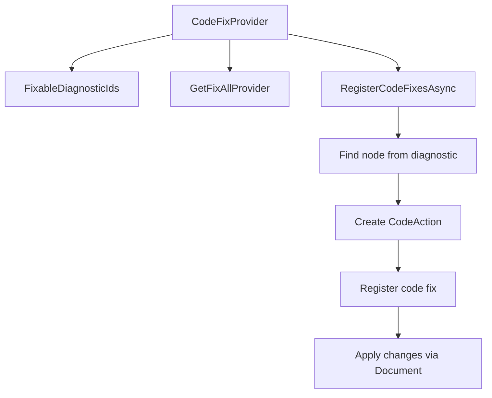

# План: CodeFixProvider для диагностик DM0004, DM0005, DM0010, DM0011, DM0012

## Анализ существующего кода

### Изученные файлы

| Файл | Назначение |
|------|------------|
| [`DiagnosticDescriptors.cs`](../src/SingletonDI.Generator/DiagnosticDescriptors.cs) | Определения всех диагностик |
| [`SingletonDIPartialCodeFixProvider.cs`](../src/SingletonDI.Refactoring/SingletonDIPartialCodeFixProvider.cs) | Существующий CodeFix для DM0007 |
| [`SingletonDIProvideRefactoringProvider.cs`](../src/SingletonDI.Refactoring/SingletonDIProvideRefactoringProvider.cs) | Пример CodeRefactoringProvider |
| [`ProviderValidator.cs`](../src/SingletonDI.Generator/Validators/ProviderValidator.cs) | Валидация провайдеров (DM0004, DM0005, DM0012) |
| [`ConsumerValidator.cs`](../src/SingletonDI.Generator/Validators/ConsumerValidator.cs) | Валидация потребителей (DM0010, DM0011) |

### Паттерн CodeFixProvider



---

## Детальный план по каждой диагностике

### 1. DM0004 — Missing parameterless constructor

**Диагностика:**
- ID: `DM0004`
- Title: "Missing parameterless constructor"
- Message: "[SingletonDIProvide] class '{0}' must have a public parameterless constructor."
- Location: `typeDecl.Identifier.GetLocation()` — идентификатор типа

**Проблема:** Класс с `[SingletonDIProvide]` не имеет публичного конструктора без параметров.

**Code Fix:** Добавить публичный конструктор без параметров.

**Алгоритм:**
1. Найти `TypeDeclarationSyntax` по location диагностике
2. Проверить, есть ли уже конструкторы в классе
3. Создать публичный конструктор без параметров
4. Если есть другие конструкторы с параметрами — добавить вызов `this()` или оставить пустым
5. Вставить конструктор в начало членов класса

**Сложность:** Средняя
- Нужно учитывать существующие конструкторы
- Нужно учитывать поля/свойства которые могут требовать инициализации
- Нужно корректно отформатировать код

**Код действия:**
```csharp
// Создание конструктора
var constructor = SyntaxFactory.ConstructorDeclaration(typeDeclaration.Identifier.Text)
    .AddModifiers(SyntaxFactory.Token(SyntaxKind.PublicKeyword))
    .WithBody(SyntaxFactory.Block())
    .WithAdditionalAnnotations(Formatter.Annotation);
```

---

### 2. DM0005 — InitializeAsync not accessible

**Диагностика:**
- ID: `DM0005`
- Title: "InitializeAsync method has inaccessible access modifier"
- Message: "Method InitializeAsync has access modifier '{0}' which makes it inaccessible..."
- Location: `initializeAsyncMethod.Locations.FirstOrDefault()` — местоположение метода

**Проблема:** Метод `InitializeAsync` имеет модификатор `private`, `protected` или `private protected`.

**Code Fix:** Изменить модификатор доступа на `public`.

**Алгоритм:**
1. Найти `MethodDeclarationSyntax` по location диагностике
2. Получить текущие модификаторы
3. Удалить существующий модификатор доступа
4. Добавить модификатор `public`
5. Сохранить остальные модификаторы (async, virtual, override и т.д.)

**Сложность:** Низкая
- Простая замена модификатора
- Нужно сохранить порядок модификаторов

**Код действия:**
```csharp
// Замена модификатора доступа на public
var newModifiers = methodDeclaration.Modifiers
    .Where(m => !IsAccessModifier(m.Kind()))
    .Prepend(SyntaxFactory.Token(SyntaxKind.PublicKeyword))
    .ToArray();

var newMethod = methodDeclaration.WithModifiers(new SyntaxTokenList(newModifiers));
```

---

### 3. DM0010 — Duplicate type in SingletonDIConsume

**Диагностика:**
- ID: `DM0010`
- Title: "Duplicate type in SingletonDIConsume attribute arguments"
- Message: "Type '{0}' is specified multiple times in SingletonDIConsume attribute..."
- Location: `location ?? typeDecl.Identifier.GetLocation()` — местоположение типа в `typeof()`

**Проблема:** Тип указан несколько раз в атрибуте `[SingletonDIConsume]`.

**Code Fix:** Удалить дублирующийся тип из атрибута.

**Алгоритм:**
1. Найти `AttributeSyntax` по location диагностике
2. Получить все аргументы атрибута
3. Определить, какой аргумент является дубликатом
4. Удалить дублирующийся аргумент
5. Обновить атрибут

**Сложность:** Средняя
- Нужно работать с синтаксисом атрибутов
- Нужно корректно обработать `typeof()` выражения
- Нужно сохранить форматирование

**Код действия:**
```csharp
// Найти аргумент с дублирующимся типом и удалить его
var argumentList = attribute.ArgumentList;
var newArguments = argumentList.Arguments
    .Where((arg, index) => !IsDuplicateAt(index, diagnostic))
    .ToArray();

var newArgumentList = SyntaxFactory.AttributeArgumentList()
    .AddArguments(newArguments);
```

---

### 4. DM0011 — Type already declared in base class

**Диагностика:**
- ID: `DM0011`
- Title: "Type already declared in base class"
- Message: "Type '{0}' is already declared in base class '{1}'. Remove the duplicate declaration."
- Location: `location ?? typeDecl.Identifier.GetLocation()` — местоположение типа в `typeof()`

**Проблема:** Тип уже объявлен в базовом классе через `[SingletonDIConsume]`.

**Code Fix:** Удалить дублирующийся тип из атрибута.

**Алгоритм:**
1. Найти `AttributeSyntax` по location диагностике
2. Получить все аргументы атрибута
3. Найти аргумент с типом, который уже есть в базовом классе
4. Удалить этот аргумент
5. Если аргументов не осталось — можно удалить весь атрибут (опционально)

**Сложность:** Средняя
- Аналогично DM0010
- Дополнительно: если все аргументы удалены, можно удалить атрибут

**Код действия:**
```csharp
// Удалить аргумент с типом из базового класса
var argumentList = attribute.ArgumentList;
var newArguments = argumentList.Arguments
    .Where(arg => !IsTypeInBaseClass(arg, diagnostic))
    .ToArray();

if (newArguments.Length == 0)
{
    // Удалить весь атрибут
    var newAttributeList = attributeList.RemoveNode(attribute, SyntaxRemoveOptions.KeepNoTrivia);
}
else
{
    // Обновить список аргументов
    var newArgumentList = SyntaxFactory.AttributeArgumentList()
        .AddArguments(newArguments);
}
```

---

### 5. DM0012 — InitializeAsync is static

**Диагностика:**
- ID: `DM0012`
- Title: "InitializeAsync method cannot be static"
- Message: "Method InitializeAsync in class '{0}' is static. InitializeAsync must be an instance method."
- Location: `initializeAsyncMethod.Locations.FirstOrDefault()` — местоположение метода

**Проблема:** Метод `InitializeAsync` объявлен как `static`.

**Code Fix:** Удалить модификатор `static`.

**Алгоритм:**
1. Найти `MethodDeclarationSyntax` по location диагностике
2. Получить текущие модификаторы
3. Удалить модификатор `static`
4. Сохранить остальные модификаторы

**Сложность:** Низкая
- Простое удаление одного модификатора

**Код действия:**
```csharp
// Удалить модификатор static
var newModifiers = methodDeclaration.Modifiers
    .Where(m => !m.IsKind(SyntaxKind.StaticKeyword))
    .ToArray();

var newMethod = methodDeclaration.WithModifiers(new SyntaxTokenList(newModifiers));
```

---

## Архитектура решения

### Вариант 1: Отдельные классы для каждого CodeFix

```
SingletonDI.Refactoring/
├── SingletonDIPartialCodeFixProvider.cs      (DM0007) — существует
├── SingletonDIConstructorCodeFixProvider.cs   (DM0004) — новый
├── SingletonDIInitializeAsyncAccessCodeFixProvider.cs (DM0005) — новый
├── SingletonDIDuplicateTypeCodeFixProvider.cs (DM0010, DM0011) — новый
└── SingletonDIStaticCodeFixProvider.cs        (DM0012) — новый
```

### Вариант 2: Объединённый провайдер (рекомендуется)

```
SingletonDI.Refactoring/
├── SingletonDIPartialCodeFixProvider.cs       (DM0007) — существует
├── SingletonDIProviderCodeFixProvider.cs      (DM0004, DM0005, DM0012) — новый
└── SingletonDIConsumerCodeFixProvider.cs      (DM0010, DM0011) — новый
```

**Рекомендация:** Вариант 2 — логическая группировка по домену:
- Provider-related: DM0004, DM0005, DM0012
- Consumer-related: DM0010, DM0011

---

## TODO List

### Phase 1: Provider CodeFixProvider (DM0004, DM0005, DM0012)

- [ ] Создать `SingletonDIProviderCodeFixProvider.cs`
- [ ] Реализовать CodeFix для DM0004 (добавить конструктор)
- [ ] Реализовать CodeFix для DM0005 (изменить модификатор на public)
- [ ] Реализовать CodeFix для DM0012 (удалить static)
- [ ] Добавить unit-тесты для каждого CodeFix

### Phase 2: Consumer CodeFixProvider (DM0010, DM0011)

- [ ] Создать `SingletonDIConsumerCodeFixProvider.cs`
- [ ] Реализовать CodeFix для DM0010 (удалить дубликат)
- [ ] Реализовать CodeFix для DM0011 (удалить тип из базового класса)
- [ ] Добавить unit-тесты для каждого CodeFix

### Phase 3: Тестирование

- [ ] Создать тестовый проект или расширить существующий
- [ ] Добавить тесты с использованием `Microsoft.CodeAnalysis.Testing`
- [ ] Протестировать edge cases

---

## Технические детали

### Зависимости

Проект уже имеет необходимую зависимость:
```xml
<PackageReference Include="Microsoft.CodeAnalysis.CSharp.Workspaces" Version="5.0.0" />
```

### Базовая структура CodeFixProvider

```csharp
[ExportCodeFixProvider(LanguageNames.CSharp, Name = nameof(...))]
[Shared]
public class ...CodeFixProvider : CodeFixProvider
{
    public override ImmutableArray<string> FixableDiagnosticIds => [...];
    
    public override FixAllProvider? GetFixAllProvider() =>
        WellKnownFixAllProviders.BatchFixer;
    
    public override async Task RegisterCodeFixesAsync(CodeFixContext context)
    {
        // Implementation
    }
}
```

### Важные моменты

1. **Formatter.Annotation** — обязательно использовать для корректного форматирования
2. **ConfigureAwait(false)** — использовать во всех await вызовах
3. **CancellationToken** — передавать во все асинхронные операции
4. **SyntaxRemoveOptions** — использовать при удалении узлов

---

## Риски и ограничения

### DM0004 (конструктор)
- **Риск:** Если класс имеет поля только для чтения, конструктор без параметров не сможет их инициализировать
- **Решение:** Добавить предупреждение в документацию, CodeFix только создаёт пустой конструктор

### DM0010, DM0011 (удаление аргументов)
- **Риск:** При удалении всех аргументов атрибут станет пустым
- **Решение:** Удалить весь атрибут если аргументов не осталось

### DM0005, DM0012 (изменение метода)
- **Риск:** Изменение сигнатуры может сломать вызовы
- **Решение:** CodeFix только меняет модификаторы, не сигнатуру
