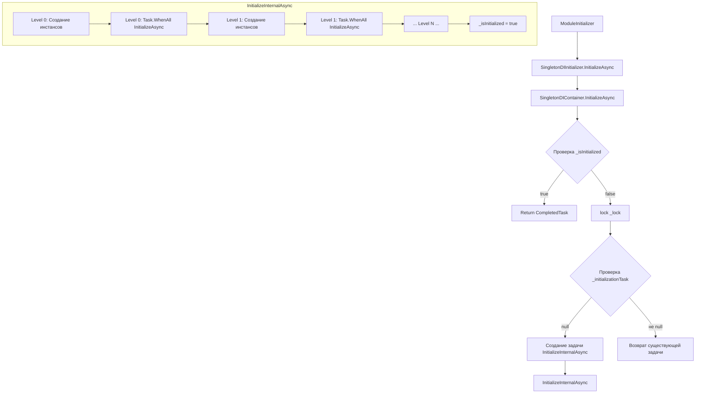
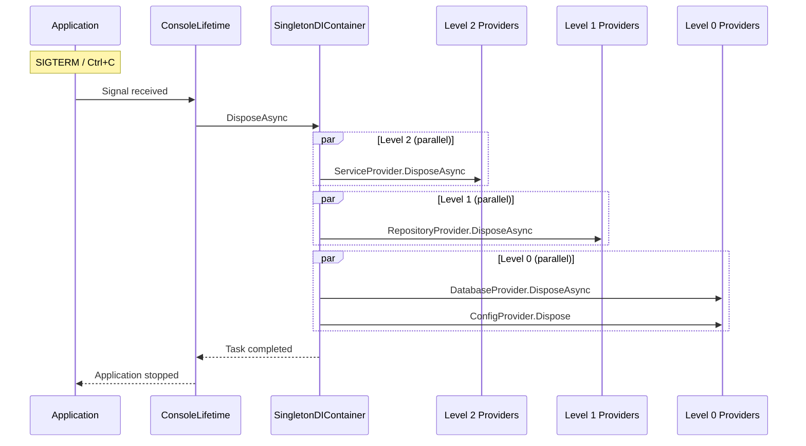
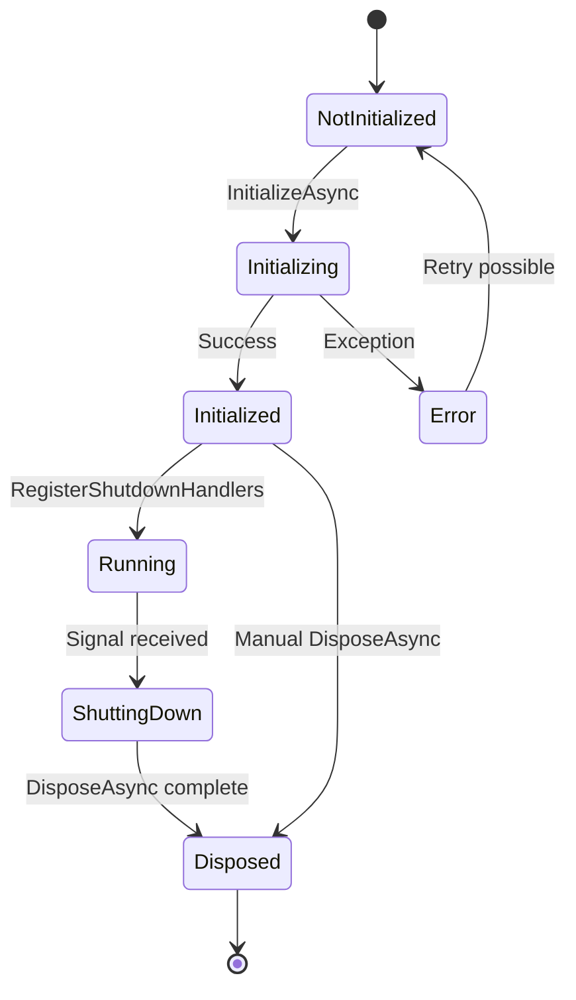

# Проектирование механизма Dispose для SingletonDI

## Обзор текущей архитектуры инициализации

### Компоненты

| Компонент | Назначение |
|-----------|------------|
| [`TopologicalSorter.SortByLevels()`](../src/SingletonDI.Generator/Helpers/TopologicalSorter.cs:200) | Группирует провайдеры по уровням зависимости |
| [`ContainerEmitter.Generate()`](../src/SingletonDI.Generator/Emitters/ContainerEmitter.cs:18) | Генерирует класс `SingletonDIContainer` |
| [`ProviderModel`](../src/SingletonDI.Generator/Models/ProviderModel.cs:9) | Модель провайдера с метаданными |
| [`ProviderValidator.Validate()`](../src/SingletonDI.Generator/Validators/ProviderValidator.cs:18) | Валидация и создание модели |

### Алгоритм инициализации



### Уровни зависимости

Провайдеры группируются по уровням:
- **Level 0**: Нет зависимостей от других провайдеров
- **Level N**: Зависит только от провайдеров уровней 0..N-1

Пример:
```
Level 0: DatabaseProvider, ConfigProvider (нет зависимостей)
Level 1: RepositoryProvider (зависит от DatabaseProvider)
Level 2: ServiceProvider (зависит от RepositoryProvider)
```

### Текущая реализация Dispose

В [`ContainerEmitter.cs`](../src/SingletonDI.Generator/Emitters/ContainerEmitter.cs:177) присутствует базовая реализация:

```csharp
// Текущая реализация - ПРОБЛЕМА!
var disposableProviders = validProviders.Where(p => p.IsDisposable).ToList();
// ...
foreach (var provider in disposableProviders.AsEnumerable().Reverse())
{
    // Dispose в обратном порядке списка, но НЕ по уровням!
}
```

**Проблемы текущей реализации**:
1. `Reverse()` реверсирует плоский список, а не идёт по уровням в обратном порядке
2. Нет поддержки `IAsyncDisposable`
3. Нет параллельного Dispose для синглтонов одного уровня
4. Нет обработки сигналов ОС

---

## Дизайн механизма Dispose

### Принципы

1. **Обратный порядок по уровням**: Level N → Level N-1 → ... → Level 0
2. **Параллельный Dispose**: Синглтоны одного уровня освобождаются параллельно
3. **Предпочтение Async**: `DisposeAsync` > `Dispose` если оба интерфейса реализованы
4. **Graceful Shutdown**: Обработка сигналов ОС для корректного завершения

### Диаграмма последовательности Dispose



---

## Необходимые изменения

### 1. ProviderModel - добавить поддержку IAsyncDisposable

**Файл**: [`src/SingletonDI.Generator/Models/ProviderModel.cs`](../src/SingletonDI.Generator/Models/ProviderModel.cs)

```csharp
public readonly record struct ProviderModel(
    // ... существующие поля ...
    bool isAsyncDisposable,  // НОВОЕ: реализует IAsyncDisposable
    // ...
)
```

### 2. ProviderValidator - определение IAsyncDisposable

**Файл**: [`src/SingletonDI.Generator/Validators/ProviderValidator.cs`](../src/SingletonDI.Generator/Validators/ProviderValidator.cs)

Добавить проверку:

```csharp
// Проверка на IAsyncDisposable
var isAsyncDisposable = typeSymbol.Interfaces.Any(i =>
    i.OriginalDefinition.ToDisplayString() == "System.IAsyncDisposable");
```

### 3. ContainerEmitter - генерация DisposeAsync

**Файл**: [`src/SingletonDI.Generator/Emitters/ContainerEmitter.cs`](../src/SingletonDI.Generator/Emitters/ContainerEmitter.cs)

#### 3.1 Новые поля

```csharp
private static volatile bool _isDisposed;
private static volatile bool _isDisposing;
```

#### 3.2 Псевдокод DisposeInternalAsync

```csharp
private static async global::System.Threading.Tasks.Task DisposeInternalAsync()
{
    if (_isDisposed || _isDisposing) return;
    
    _isDisposing = true;
    
    try
    {
        // Обратный порядок уровней: N → N-1 → ... → 0
        for (var levelIndex = _levels.Count - 1; levelIndex >= 0; levelIndex--)
        {
            var level = _levels[levelIndex];
            
            // Фильтруем disposable провайдеры этого уровня
            var disposableProviders = level
                .Where(p => p.IsDisposable || p.IsAsyncDisposable)
                .ToList();
            
            if (disposableProviders.Count == 0) continue;
            
            // Параллельный dispose для уровня
            var tasks = new List<global::System.Threading.Tasks.Task>();
            
            foreach (var provider in disposableProviders)
            {
                var fieldName = GetFieldName(provider);
                
                if (provider.IsAsyncDisposable)
                {
                    // Предпочитаем DisposeAsync
                    tasks.Add(_{fieldName}!.DisposeAsync().AsTask());
                }
                else if (provider.IsDisposable)
                {
                    // Fallback на Dispose (оборачиваем в Task)
                    _{fieldName}?.Dispose();
                }
            }
            
            if (tasks.Count > 0)
            {
                await global::System.Threading.Tasks.Task.WhenAll(tasks)
                    .ConfigureAwait(false);
            }
        }
        
        _isDisposed = true;
    }
    finally
    {
        _isDisposing = false;
    }
}
```

#### 3.3 Публичный API

```csharp
/// <summary>
/// Disposes all singleton instances asynchronously.
/// Instances are disposed in reverse dependency order.
/// </summary>
public static global::System.Threading.Tasks.Task DisposeAsync()
{
    if (_isDisposed) return global::System.Threading.Tasks.Task.CompletedTask;
    
    lock (_lock)
    {
        if (_isDisposed) return global::System.Threading.Tasks.Task.CompletedTask;
        
        if (_disposeTask == null)
        {
            _disposeTask = DisposeInternalAsync();
        }
        
        return _disposeTask;
    }
}
```

### 4. Новый эмиттер - LifetimeEmitter

**Новый файл**: `src/SingletonDI.Generator/Emitters/LifetimeEmitter.cs`

Генерирует класс для обработки сигналов ОС:

```csharp
namespace SingletonDI.Generated.Internal;

/// <summary>
/// Handles OS signals for graceful shutdown.
/// </summary>
internal static class SingletonDILifetime
{
    private static IEnumerable<IDisposable>? _signalRegistrations;
    private static volatile bool _isShuttingDown;
    
    /// <summary>
    /// Registers OS signal handlers for graceful shutdown.
    /// Call this at application startup.
    /// </summary>
    public static void RegisterShutdownHandlers()
    {
        if (_isShuttingDown) return;
        
        _signalRegistrations = new IDisposable[]
        {
            PosixSignalRegistration.Create(PosixSignal.SIGINT, HandleSignal),
            PosixSignalRegistration.Create(PosixSignal.SIGQUIT, HandleSignal),
            PosixSignalRegistration.Create(PosixSignal.SIGTERM, HandleSignal)
        };
        
        AppDomain.CurrentDomain.ProcessExit += OnProcessExit;
        Console.CancelKeyPress += OnCancelKeyPress;
    }
    
    private static void HandleSignal(PosixSignalContext context)
    {
        context.Cancel = true;
        ShutdownAsync().GetAwaiter().GetResult();
    }
    
    private static void OnProcessExit(object? sender, EventArgs e)
    {
        if (!_isShuttingDown)
        {
            ShutdownAsync().GetAwaiter().GetResult();
        }
    }
    
    private static void OnCancelKeyPress(object? sender, ConsoleCancelEventArgs e)
    {
        e.Cancel = true;
        ShutdownAsync().GetAwaiter().GetResult();
    }
    
    /// <summary>
    /// Performs graceful shutdown: disposes all singletons.
    /// </summary>
    public static async Task ShutdownAsync()
    {
        if (_isShuttingDown) return;
        _isShuttingDown = true;
        
        try
        {
            await SingletonDIContainer.DisposeAsync().ConfigureAwait(false);
        }
        finally
        {
            // Cleanup signal registrations
            if (_signalRegistrations != null)
            {
                foreach (var reg in _signalRegistrations)
                {
                    reg.Dispose();
                }
            }
        }
    }
}
```

### 5. Обновление SingletonDIInitializer

**Файл**: [`src/SingletonDI.Generator/Emitters/SingletonInitializerEmitter.cs`](../src/SingletonDI.Generator/Emitters/SingletonInitializerEmitter.cs)

```csharp
public static class SingletonDIInitializer
{
    /// <summary>
    /// Initializes all singleton instances asynchronously.
    /// </summary>
    public static global::System.Threading.Tasks.Task InitializeAsync() =>
        Internal.SingletonDIContainer.InitializeAsync();
    
    /// <summary>
    /// Registers OS signal handlers for graceful shutdown.
    /// Call this after InitializeAsync at application startup.
    /// </summary>
    public static void RegisterShutdownHandlers() =>
        Internal.SingletonDILifetime.RegisterShutdownHandlers();
    
    /// <summary>
    /// Disposes all singleton instances asynchronously.
    /// Usually called automatically by signal handlers.
    /// </summary>
    public static global::System.Threading.Tasks.Task DisposeAsync() =>
        Internal.SingletonDIContainer.DisposeAsync();
}
```

---

## План обработки сигналов ОС

### Поддерживаемые сигналы

| Сигнал | Платформа | Описание |
|--------|-----------|----------|
| SIGINT | Unix/Windows | Ctrl+C |
| SIGTERM | Unix | Стандартный сигнал завершения |
| SIGQUIT | Unix | Quit from keyboard |
| ProcessExit | All | .NET ProcessExit event |
| CancelKeyPress | All | Console.CancelKeyPress |

### Диаграмма состояний



### Интеграция с приложением

```csharp
// Program.cs
using SingletonDI.Generated;

// Инициализация
await SingletonDIInitializer.InitializeAsync();

// Регистрация обработчиков shutdown
SingletonDIInitializer.RegisterShutdownHandlers();

// Приложение работает...
// При получении SIGTERM/SIGINT автоматически вызовется DisposeAsync
```

---

## Изменения в Attributes проекте

### Новые интерфейсы не требуются

Используются стандартные интерфейсы .NET:
- `System.IDisposable` - синхронный dispose
- `System.IAsyncDisposable` - асинхронный dispose

Провайдеры могут реализовывать:
1. Только `IDisposable` - будет вызван `Dispose()`
2. Только `IAsyncDisposable` - будет вызван `DisposeAsync()`
3. Оба интерфейса - будет вызван `DisposeAsync()` (предпочтение async)

---

## Изменения в Generator проекте

### Сводка изменений

| Файл | Изменение |
|------|-----------|
| `Models/ProviderModel.cs` | Добавить `IsAsyncDisposable` |
| `Validators/ProviderValidator.cs` | Проверка `IAsyncDisposable` |
| `Emitters/ContainerEmitter.cs` | Генерация `DisposeAsync()`, `_isDisposed`, `_isDisposing` |
| `Emitters/LifetimeEmitter.cs` | **НОВЫЙ** - генерация `SingletonDILifetime` |
| `Emitters/SingletonInitializerEmitter.cs` | Добавить `RegisterShutdownHandlers()`, `DisposeAsync()` |
| `SingletonDIGenerator.cs` | Регистрация `LifetimeEmitter` |

---

## Пример сгенерированного кода

### Container с DisposeAsync

```csharp
// <auto-generated/>
#nullable enable

namespace SingletonDI.Generated.Internal
{
    internal static partial class SingletonDIContainer
    {
        private static volatile bool _isInitialized;
        private static volatile bool _isDisposed;
        private static volatile bool _isDisposing;
        private static readonly object _lock = new object();
        private static global::System.Threading.Tasks.Task? _initializationTask;
        private static global::System.Threading.Tasks.Task? _disposeTask;
        
        // ... singleton fields ...
        
        // InitializeAsync - без изменений
        
        public static async global::System.Threading.Tasks.Task DisposeAsync()
        {
            if (_isDisposed) return;
            
            lock (_lock)
            {
                if (_isDisposed) return;
                if (_disposeTask != null) return _disposeTask;
                _disposeTask = DisposeInternalAsync();
            }
            
            await _disposeTask.ConfigureAwait(false);
        }
        
        private static async global::System.Threading.Tasks.Task DisposeInternalAsync()
        {
            _isDisposing = true;
            
            try
            {
                // Level 2 (reverse order)
                if (_ServiceProvider is global::System.IAsyncDisposable asyncDisp2)
                    await asyncDisp2.DisposeAsync().ConfigureAwait(false);
                else if (_ServiceProvider is global::System.IDisposable disp2)
                    disp2.Dispose();
                
                // Level 1
                if (_RepositoryProvider is global::System.IAsyncDisposable asyncDisp1)
                    await asyncDisp1.DisposeAsync().ConfigureAwait(false);
                else if (_RepositoryProvider is global::System.IDisposable disp1)
                    disp1.Dispose();
                
                // Level 0 (parallel)
                var tasks = new List<global::System.Threading.Tasks.Task>();
                
                if (_DatabaseProvider is global::System.IAsyncDisposable asyncDisp0a)
                    tasks.Add(asyncDisp0a.DisposeAsync().AsTask());
                else if (_DatabaseProvider is global::System.IDisposable disp0a)
                    disp0a.Dispose();
                
                if (_ConfigProvider is global::System.IDisposable disp0b)
                    disp0b.Dispose();
                
                if (tasks.Count > 0)
                    await global::System.Threading.Tasks.Task.WhenAll(tasks).ConfigureAwait(false);
                
                _isDisposed = true;
            }
            finally
            {
                _isDisposing = false;
            }
        }
    }
}
```

---

## Вопросы для обсуждения

1. **Нужен ли метод `WaitForShutdownAsync()`** для явного ожидания завершения?
2. **Таймаут на Dispose** - что делать если dispose зависает?
3. **Логирование** - нужен ли интерфейс для логирования событий shutdown?
4. **Конфигурация** - возможность отключить автоматическую обработку сигналов?

---

## Следующие шаги

1. Обновить `ProviderModel` с полем `IsAsyncDisposable`
2. Обновить `ProviderValidator` для определения `IAsyncDisposable`
3. Переписать `ContainerEmitter.Generate()` с поддержкой уровней для Dispose
4. Создать `LifetimeEmitter` для генерации `SingletonDILifetime`
5. Обновить `SingletonInitializerEmitter` с новыми методами
6. Добавить тесты для нового функционала
