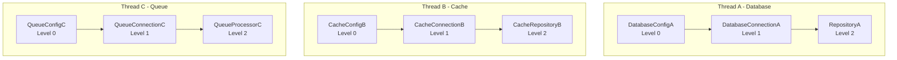
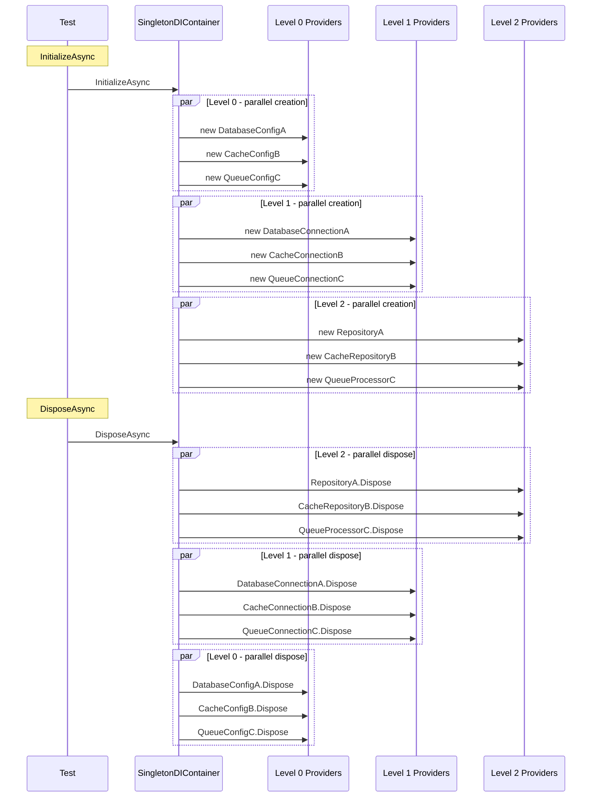

# Проектирование теста порядка создания/уничтожения синглтонов

## 1. Анализ существующей архитектуры

### 1.1 Компиляция из строки

Тесты используют подход с компиляцией исходного кода из строки через:

- [`DiagnosticErrorTests.RunGenerator()`](../tests/SingletonDI.Tests/DiagnosticErrorTests.cs:1136) - запускает генератор и возвращает диагностику
- [`DiagnosticErrorTests.CreateCompilation()`](../tests/SingletonDI.Tests/DiagnosticErrorTests.cs:1145) - создаёт компиляцию из строки

**Ключевой паттерн**:
```csharp
private static ImmutableArray<Diagnostic> RunGenerator(string source)
{
    var compilation = CreateCompilation(source);
    var generator = new SingletonDIGenerator();
    var driver = CSharpGeneratorDriver.Create(generator);
    driver.RunGeneratorsAndUpdateCompilation(compilation, out _, out var diagnostics);
    return diagnostics;
}
```

### 1.2 Генерация Container

[`ContainerEmitter.Generate()`](../src/SingletonDI.Generator/Emitters/ContainerEmitter.cs:18) создаёт:

1. **Поля для синглтонов** - `private static Type? _FieldName;`
2. **Свойства доступа** - `public static Type FieldName => _FieldName ?? ExceptionHelper.ThrowNotInitialized<Type>();`
3. **InitializeAsync()** - создаёт инстансы по уровням, затем вызывает InitializeAsync
4. **DisposeAsync()** - уничтожает в обратном порядке по уровням

### 1.3 Уровни зависимости

Провайдеры группируются по уровням через топологическую сортировку:

- **Level 0**: Нет зависимостей от других провайдеров
- **Level N**: Зависит только от провайдеров уровней 0..N-1

**Порядок создания**: Level 0 → Level 1 → ... → Level N  
**Порядок уничтожения**: Level N → Level N-1 → ... → Level 0

---

## 2. Проект структуры теста

### 2.1 Диаграмма зависимостей



### 2.2 Структура классов-синглтонов

| Нить | Level 0 | Level 1 | Level 2 |
|------|---------|---------|---------|
| A | DatabaseConfigA | DatabaseConnectionA | RepositoryA |
| B | CacheConfigB | CacheConnectionB | CacheRepositoryB |
| C | QueueConfigC | QueueConnectionC | QueueProcessorC |

**Всего**: 9 синглтонов, 3 независимые нити, 3 уровня вложенности.

### 2.3 Исходный код тестовых классов

```csharp
using System;
using SingletonDI.Attributes;

namespace TestApp
{
    // ===== Нить A - Database =====
    
    [SingletonDIProvide]
    public class DatabaseConfigA : IDisposable
    {
        public DatabaseConfigA() => ActionLog.Add("Register Level 0 DatabaseConfigA");
        public void Dispose() => ActionLog.Add("Dispose Level 0 DatabaseConfigA");
    }
    
    [SingletonDIProvide]
    public class DatabaseConnectionA : IDisposable
    {
        [SingletonDIConsume(typeof(DatabaseConfigA))]
        public partial DatabaseConnectionA() => ActionLog.Add("Register Level 1 DatabaseConnectionA");
        public void Dispose() => ActionLog.Add("Dispose Level 1 DatabaseConnectionA");
    }
    
    [SingletonDIProvide]
    public class RepositoryA : IDisposable
    {
        [SingletonDIConsume(typeof(DatabaseConnectionA))]
        public partial RepositoryA() => ActionLog.Add("Register Level 2 RepositoryA");
        public void Dispose() => ActionLog.Add("Dispose Level 2 RepositoryA");
    }
    
    // ===== Нить B - Cache =====
    
    [SingletonDIProvide]
    public class CacheConfigB : IDisposable
    {
        public CacheConfigB() => ActionLog.Add("Register Level 0 CacheConfigB");
        public void Dispose() => ActionLog.Add("Dispose Level 0 CacheConfigB");
    }
    
    [SingletonDIProvide]
    public class CacheConnectionB : IDisposable
    {
        [SingletonDIConsume(typeof(CacheConfigB))]
        public partial CacheConnectionB() => ActionLog.Add("Register Level 1 CacheConnectionB");
        public void Dispose() => ActionLog.Add("Dispose Level 1 CacheConnectionB");
    }
    
    [SingletonDIProvide]
    public class CacheRepositoryB : IDisposable
    {
        [SingletonDIConsume(typeof(CacheConnectionB))]
        public partial CacheRepositoryB() => ActionLog.Add("Register Level 2 CacheRepositoryB");
        public void Dispose() => ActionLog.Add("Dispose Level 2 CacheRepositoryB");
    }
    
    // ===== Нить C - Queue =====
    
    [SingletonDIProvide]
    public class QueueConfigC : IDisposable
    {
        public QueueConfigC() => ActionLog.Add("Register Level 0 QueueConfigC");
        public void Dispose() => ActionLog.Add("Dispose Level 0 QueueConfigC");
    }
    
    [SingletonDIProvide]
    public class QueueConnectionC : IDisposable
    {
        [SingletonDIConsume(typeof(QueueConfigC))]
        public partial QueueConnectionC() => ActionLog.Add("Register Level 1 QueueConnectionC");
        public void Dispose() => ActionLog.Add("Dispose Level 1 QueueConnectionC");
    }
    
    [SingletonDIProvide]
    public class QueueProcessorC : IDisposable
    {
        [SingletonDIConsume(typeof(QueueConnectionC))]
        public partial QueueProcessorC() => ActionLog.Add("Register Level 2 QueueProcessorC");
        public void Dispose() => ActionLog.Add("Dispose Level 2 QueueProcessorC");
    }
    
    // ===== Статический логгер =====
    
    public static class ActionLog
    {
        public static readonly List<string> Actions = new();
        
        public static void Add(string action)
        {
            lock (Actions)
            {
                Actions.Add(action);
            }
        }
        
        public static void Clear() => Actions.Clear();
        
        public static IReadOnlyList<string> GetActions()
        {
            lock (Actions)
            {
                return Actions.ToList().AsReadOnly();
            }
        }
    }
}
```

---

## 3. Механизм логирования

### 3.1 Статический класс ActionLog

Используется статический класс со списком действий:

```csharp
public static class ActionLog
{
    public static readonly List<string> Actions = new();
    
    public static void Add(string action)
    {
        lock (Actions)
        {
            Actions.Add(action);
        }
    }
}
```

### 3.2 Формат записей лога

Каждая запись содержит:
- **Действие**: `Register` или `Dispose`
- **Уровень**: `Level 0`, `Level 1`, `Level 2`
- **Имя класса**: `DatabaseConfigA`, `DatabaseConnectionA`, и т.д.

**Пример лога**:
```
Register Level 0 DatabaseConfigA
Register Level 0 CacheConfigB
Register Level 0 QueueConfigC
Register Level 1 DatabaseConnectionA
Register Level 1 CacheConnectionB
Register Level 1 QueueConnectionC
Register Level 2 RepositoryA
Register Level 2 CacheRepositoryB
Register Level 2 QueueProcessorC
Dispose Level 2 RepositoryA
Dispose Level 2 CacheRepositoryB
Dispose Level 2 QueueProcessorC
Dispose Level 1 DatabaseConnectionA
Dispose Level 1 CacheConnectionB
Dispose Level 1 QueueConnectionC
Dispose Level 0 DatabaseConfigA
Dispose Level 0 CacheConfigB
Dispose Level 0 QueueConfigC
```

---

## 4. Алгоритм анализа лога

### 4.1 Структура данных для анализа

```csharp
public class LogEntry
{
    public string Action { get; init; }  // "Register" или "Dispose"
    public int Level { get; init; }       // 0, 1, 2
    public string ClassName { get; init; }
    public int Order { get; init; }       // Порядковый номер в логе
}
```

### 4.2 Правила валидации

#### Правило 1: Register перед Dispose для каждого класса

Для каждого класса должен быть Register перед Dispose:

```csharp
bool ValidateRegisterBeforeDispose(IEnumerable<LogEntry> entries)
{
    var registerMap = new Dictionary<string, int>();  // className -> order
    var disposeMap = new Dictionary<string, int>();
    
    foreach (var entry in entries)
    {
        if (entry.Action == "Register")
            registerMap[entry.ClassName] = entry.Order;
        else if (entry.Action == "Dispose")
            disposeMap[entry.ClassName] = entry.Order;
    }
    
    // Проверяем, что для каждого Dispose был Register
    foreach (var (className, disposeOrder) in disposeMap)
    {
        if (!registerMap.TryGetValue(className, out var registerOrder))
            return false;  // Dispose без Register
        
        if (registerOrder >= disposeOrder)
            return false;  // Dispose раньше Register
    }
    
    return true;
}
```

#### Правило 2: Порядок Register по уровням

Все Register уровня N должны быть раньше всех Register уровня N+1:

```csharp
bool ValidateRegisterOrder(IEnumerable<LogEntry> entries)
{
    var registers = entries
        .Where(e => e.Action == "Register")
        .OrderBy(e => e.Order)
        .ToList();
    
    for (int i = 1; i < registers.Count; i++)
    {
        if (registers[i].Level < registers[i - 1].Level)
            return false;  // Уровень N+1 раньше уровня N
    }
    
    return true;
}
```

#### Правило 3: Порядок Dispose по уровням

Все Dispose уровня N должны быть раньше всех Dispose уровня N-1:

```csharp
bool ValidateDisposeOrder(IEnumerable<LogEntry> entries)
{
    var disposes = entries
        .Where(e => e.Action == "Dispose")
        .OrderBy(e => e.Order)
        .ToList();
    
    for (int i = 1; i < disposes.Count; i++)
    {
        if (disposes[i].Level > disposes[i - 1].Level)
            return false;  // Уровень N-1 раньше уровня N
    }
    
    return true;
}
```

### 4.3 Полный алгоритм валидации

```csharp
public class LogValidator
{
    public ValidationResult Validate(IReadOnlyList<string> logActions)
    {
        var entries = ParseLogEntries(logActions);
        
        var result = new ValidationResult();
        
        // 1. Проверяем Register перед Dispose
        result.RegisterBeforeDisposeValid = ValidateRegisterBeforeDispose(entries);
        
        // 2. Проверяем порядок Register
        result.RegisterOrderValid = ValidateRegisterOrder(entries);
        
        // 3. Проверяем порядок Dispose
        result.DisposeOrderValid = ValidateDisposeOrder(entries);
        
        // 4. Проверяем полноту - все 9 классов созданы и уничтожены
        result.AllClassesCreated = ValidateAllClassesCreated(entries);
        
        return result;
    }
    
    private List<LogEntry> ParseLogEntries(IReadOnlyList<string> logActions)
    {
        var entries = new List<LogEntry>();
        
        for (int i = 0; i < logActions.Count; i++)
        {
            var parts = logActions[i].Split(' ');
            // Format: "Register Level 0 DatabaseConfigA"
            entries.Add(new LogEntry
            {
                Action = parts[0],
                Level = int.Parse(parts[2]),
                ClassName = parts[3],
                Order = i
            });
        }
        
        return entries;
    }
}

public record ValidationResult
{
    public bool RegisterBeforeDisposeValid { get; init; }
    public bool RegisterOrderValid { get; init; }
    public bool DisposeOrderValid { get; init; }
    public bool AllClassesCreated { get; init; }
    
    public bool IsValid => 
        RegisterBeforeDisposeValid && 
        RegisterOrderValid && 
        DisposeOrderValid && 
        AllClassesCreated;
}
```

---

## 5. Структура теста

### 5.1 Псевдокод теста

```csharp
[Fact]
public async Task DisposeOrder_ThreeIndependentThreads_CorrectOrder()
{
    // Arrange
    const string source = """
        // ... исходный код всех 9 классов ...
        """;
    
    // Act
    // 1. Компилируем код с генератором
    var (compilation, diagnostics) = CompileWithGenerator(source);
    Assert.Empty(diagnostics.Where(d => d.Severity == DiagnosticSeverity.Error));
    
    // 2. Загружаем сборку в память
    var assembly = LoadAssembly(compilation);
    
    // 3. Получаем типы
    var actionLogType = assembly.GetType("TestApp.ActionLog");
    var containerType = assembly.GetType("SingletonDI.Generated.Internal.SingletonDIContainer");
    
    // 4. Очищаем лог
    actionLogType.GetMethod("Clear")!.Invoke(null, null);
    
    // 5. Инициализируем контейнер
    var initializeMethod = containerType.GetMethod("InitializeAsync");
    var initTask = (Task)initializeMethod!.Invoke(null, null)!;
    await initTask;
    
    // 6. Уничтожаем контейнер
    var disposeMethod = containerType.GetMethod("DisposeAsync");
    var disposeTask = (ValueTask)disposeMethod!.Invoke(null, null)!;
    await disposeTask;
    
    // 7. Получаем лог
    var getActionsMethod = actionLogType.GetMethod("GetActions");
    var actions = (IReadOnlyList<string>)getActionsMethod!.Invoke(null, null)!;
    
    // Assert
    var validator = new LogValidator();
    var result = validator.Validate(actions);
    
    Assert.True(result.RegisterBeforeDisposeValid, 
        "Register must be called before Dispose for each class");
    Assert.True(result.RegisterOrderValid, 
        "Register order must be: Level 0, then Level 1, then Level 2");
    Assert.True(result.DisposeOrderValid, 
        "Dispose order must be: Level 2, then Level 1, then Level 0");
    Assert.True(result.AllClassesCreated, 
        "All 9 classes must be created and disposed");
}
```

### 5.2 Вспомогательные методы компиляции

```csharp
private static (CSharpCompilation compilation, ImmutableArray<Diagnostic> diagnostics) 
    CompileWithGenerator(string source)
{
    var compilation = CreateCompilation(source);
    var generator = new SingletonDIGenerator();
    var driver = CSharpGeneratorDriver.Create(generator);
    driver.RunGeneratorsAndUpdateCompilation(compilation, out var outputCompilation, out var diagnostics);
    return (outputCompilation, diagnostics);
}

private static Assembly LoadAssembly(CSharpCompilation compilation)
{
    using var ms = new MemoryStream();
    var emitResult = compilation.Emit(ms);
    
    if (!emitResult.Success)
        throw new InvalidOperationException("Compilation failed: " + 
            string.Join(", ", emitResult.Diagnostics));
    
    return Assembly.Load(ms.ToArray());
}
```

---

## 6. Ожидаемый результат

### 6.1 Ожидаемый лог

```
Register Level 0 DatabaseConfigA
Register Level 0 CacheConfigB
Register Level 0 QueueConfigC
Register Level 1 DatabaseConnectionA
Register Level 1 CacheConnectionB
Register Level 1 QueueConnectionC
Register Level 2 RepositoryA
Register Level 2 CacheRepositoryB
Register Level 2 QueueProcessorC
Dispose Level 2 RepositoryA
Dispose Level 2 CacheRepositoryB
Dispose Level 2 QueueProcessorC
Dispose Level 1 DatabaseConnectionA
Dispose Level 1 CacheConnectionB
Dispose Level 1 QueueConnectionC
Dispose Level 0 DatabaseConfigA
Dispose Level 0 CacheConfigB
Dispose Level 0 QueueConfigC
```

### 6.2 Визуализация порядка



---

## 7. Особенности реализации

### 7.1 Параллельное создание/уничтожение

Провайдеры одного уровня создаются и уничтожаются параллельно. Это означает:

- Порядок внутри уровня может быть любым
- `DatabaseConfigA` может быть создан раньше или позже `CacheConfigB`
- Но все Level 0 будут созданы раньше любого Level 1

### 7.2 Thread-safety логирования

Используется `lock` при добавлении записей в лог:

```csharp
public static void Add(string action)
{
    lock (Actions)
    {
        Actions.Add(action);
    }
}
```

### 7.3 Динамическая загрузка сборки

Тест использует reflection для вызова методов сгенерированного контейнера:

```csharp
var initTask = (Task)initializeMethod!.Invoke(null, null)!;
await initTask;
```

---

## 8. Альтернативные подходы

### 8.1 Использование GeneratedOutput

Вместо динамической загрузки можно анализировать сгенерированный код:

```csharp
var generatedOutput = GetGeneratedOutput(compilation);
// Проверяем структуру сгенерированного кода
```

**Плюсы**: Не требует загрузки сборки  
**Минусы**: Не проверяет runtime поведение

### 8.2 Использование отдельного тестового проекта

Создать отдельный тестовый проект с реальными классами:

**Плюсы**: Проще отладка, реальный код  
**Минусы**: Требует отдельного проекта, сложнее поддерживать

---

## 9. Рекомендации по реализации

1. **Создать новый файл теста**: `tests/SingletonDI.Tests/DisposeOrderTests.cs`

2. **Использовать существующий паттерн компиляции** из [`DiagnosticErrorTests.cs`](../tests/SingletonDI.Tests/DiagnosticErrorTests.cs)

3. **Добавить необходимые ссылки** для `IDisposable` и `ValueTask`

4. **Реализовать LogValidator** как внутренний класс теста

5. **Добавить несколько тестов**:
   - Основной тест с 3 нитями
   - Тест с 1 нитью (простой случай)
   - Тест с ошибкой инициализации (проверка отката)
