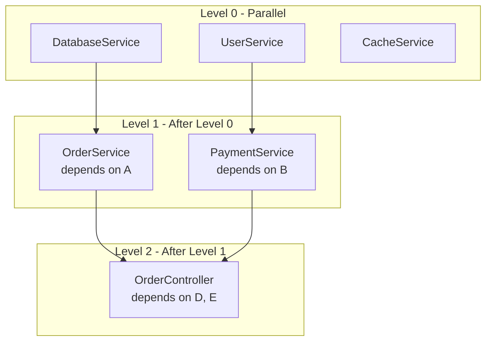
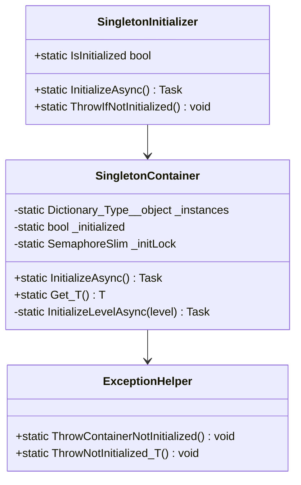

# План: Редизайн системы инициализации SingletonDI

## 1. Анализ текущей архитектуры

### 1.1 Текущий механизм инициализации

**Файл:** [`ContainerEmitter.cs`](src/SingletonDI.Generator/Emitters/ContainerEmitter.cs)

```
┌─────────────────────────────────────────────────────────────┐
│                  Текущий подход                              │
├─────────────────────────────────────────────────────────────┤
│  [ModuleInitializer]                                         │
│       ↓                                                      │
│  SingletonContainer.Initialize() - синхронный метод         │
│       ↓                                                      │
│  lock + последовательное создание синглтонов                │
│       ↓                                                      │
│  Для async: Task.Run().GetAwaiter().GetResult()             │
│       ↓                                                      │
│  Блокировка потока на время инициализации                    │
└─────────────────────────────────────────────────────────────┘
```

**Проблемы:**
1. **ModuleInitializer** - пользователь не контролирует момент инициализации
2. **Синхронная блокировка** - `GetAwaiter().GetResult()` блокирует поток
3. **Последовательная инициализация** - нет параллелизма даже для независимых синглтонов
4. **Nullable свойства** - `Type?` неудобен в использовании

### 1.2 Текущая топологическая сортировка

**Файл:** [`TopologicalSorter.cs`](src/SingletonDI.Generator/Helpers/TopologicalSorter.cs)

Использует алгоритм Кана (BFS), возвращает плоский список в порядке зависимостей. Не группирует по уровням для параллельной инициализации.

### 1.3 Текущие потребители

**Файл:** [`ConsumerEmitter.cs`](src/SingletonDI.Generator/Emitters/ConsumerEmitter.cs)

Генерирует nullable свойства:
```csharp
public DatabaseService? DatabaseServiceInstance
{
    get
    {
        SingletonContainer.ThrowIfNotInitialized();
        return SingletonContainer.DatabaseService;
    }
}
```

---

## 2. Предлагаемая новая архитектура

### 2.1 Обзор изменений

```
┌─────────────────────────────────────────────────────────────┐
│                  Новый подход                                │
├─────────────────────────────────────────────────────────────┤
│  Пользователь вызывает:                                      │
│  await SingletonContainer.InitializeAsync()                 │
│       ↓                                                      │
│  Анализ уровней зависимостей                                 │
│       ↓                                                      │
│  Параллельная инициализация независимых синглтонов          │
│       ↓                                                      │
│  Последовательная инициализация зависимых цепочек           │
│       ↓                                                      │
│  Non-nullable свойства с исключением при ошибке             │
└─────────────────────────────────────────────────────────────┘
```

### 2.2 Алгоритм параллельной инициализации



**Алгоритм:**
1. Разделить синглтоны на уровни по глубине зависимостей
2. Уровень 0: нет зависимостей от других синглтонов
3. Уровень N: зависит от синглтонов уровня N-1 или меньше
4. Все синглтоны одного уровня инициализируются параллельно
5. Переход на следующий уровень только после завершения текущего

### 2.3 Новая структура классов



---

## 3. Детальный план изменений

### 3.1 Файл: `TopologicalSorter.cs`

**Изменения:**
- Добавить структуру `LevelGroup` для хранения уровня и его элементов
- Модифицировать метод `Sort()` для возврата уровней вместо плоского списка
- Добавить метод `GroupByLevels()` для группировки по уровням параллелизма

**Новый API:**
```csharp
public readonly struct LevelGroup
{
    public required int Level { get; init; }
    public required ImmutableArray<string> Providers { get; init; }
}

public readonly struct SortResult
{
    public required ImmutableArray<LevelGroup> Levels { get; init; }
    public required ImmutableArray<string> Cycle { get; init; }
    public bool HasCycle => !Cycle.IsEmpty;
}

public static SortResult SortByLevels(ImmutableArray<ProviderModel> providers);
```

**Алгоритм группировки по уровням:**
```csharp
// Уровень узла = максимальный уровень его зависимостей + 1
// Узлы без зависимостей = уровень 0
foreach (var node in nodes)
{
    if (node.Dependencies.IsEmpty)
        level[node] = 0;
    else
        level[node] = node.Dependencies.Max(d => level[d]) + 1;
}
```

### 3.2 Файл: `ContainerEmitter.cs`

**Изменения:**
- Убрать атрибут `[ModuleInitializer]`
- Сделать метод `Initialize()` асинхронным (`InitializeAsync()`)
- Добавить группировку инициализации по уровням
- Использовать `Task.WhenAll()` для параллельной инициализации уровня
- Добавить публичный класс-обёртку `SingletonInitializer`

**Новая структура сгенерированного кода:**
```csharp
namespace DependencyManager.Generated.Internal
{
    internal static class SingletonContainer
    {
        private static volatile bool _initialized;
        private static readonly SemaphoreSlim _initLock = new(1, 1);
        
        // Non-nullable поля (инициализируются при создании)
        internal static DatabaseService DatabaseService = null!;
        internal static UserService UserService = null!;
        internal static OrderService OrderService = null!;
        
        public static async Task InitializeAsync()
        {
            await _initLock.WaitAsync().ConfigureAwait(false);
            try
            {
                if (_initialized) return;
                
                // Level 0 - параллельная инициализация
                var level0Tasks = new List<Task>();
                
                level0Tasks.Add(Task.Run(async () =>
                {
                    DatabaseService = new DatabaseService();
                    if (DatabaseService is IInitializeSync s) s.Initialize();
                    if (DatabaseService is IInitializeAsync a) await a.InitializeAsync();
                }));
                
                level0Tasks.Add(Task.Run(async () =>
                {
                    UserService = new UserService();
                    if (UserService is IInitializeAsync a) await a.InitializeAsync();
                }));
                
                await Task.WhenAll(level0Tasks).ConfigureAwait(false);
                
                // Level 1 - после завершения Level 0
                var level1Tasks = new List<Task>();
                
                level1Tasks.Add(Task.Run(async () =>
                {
                    OrderService = new OrderService();
                    if (OrderService is IInitializeSync s) s.Initialize();
                }));
                
                await Task.WhenAll(level1Tasks).ConfigureAwait(false);
                
                _initialized = true;
            }
            finally
            {
                _initLock.Release();
            }
        }
        
        internal static void ThrowIfNotInitialized()
        {
            if (!_initialized)
                ExceptionHelper.ThrowContainerNotInitialized();
        }
    }
}

namespace DependencyManager.Generated
{
    /// <summary>
    /// Публичный класс для инициализации DI-контейнера.
    /// Вызовите SingletonInitializer.InitializeAsync() при старте приложения.
    /// </summary>
    public static class SingletonInitializer
    {
        /// <summary>
        /// Инициализирует все синглтоны с учётом зависимостей.
        /// Независимые синглтоны инициализируются параллельно.
        /// </summary>
        public static Task InitializeAsync()
            => Internal.SingletonContainer.InitializeAsync();
        
        /// <summary>
        /// Возвращает true, если контейнер инициализирован.
        /// </summary>
        public static bool IsInitialized
            => Internal.SingletonContainer.IsInitialized;
        
        /// <summary>
        /// Выбрасывает исключение, если контейнер не инициализирован.
        /// </summary>
        public static void ThrowIfNotInitialized()
            => Internal.SingletonContainer.ThrowIfNotInitialized();
    }
}
```

### 3.3 Файл: `ConsumerEmitter.cs`

**Изменения:**
- Убрать `?` у типа свойства (сделать non-nullable)
- Добавить атрибут `[MemberNotNullWhen]` для статического анализа
- Обновить XML-документацию

**Новый код свойства:**
```csharp
/// <summary>
/// Gets the singleton instance of DatabaseService.
/// Throws InvalidOperationException if container is not initialized.
/// </summary>
public DatabaseService DatabaseServiceInstance
{
    get
    {
        global::DependencyManager.Generated.Internal.SingletonContainer.ThrowIfNotInitialized();
        return global::DependencyManager.Generated.Internal.SingletonContainer.DatabaseService;
    }
}
```

### 3.4 Файл: `ExceptionHelperEmitter.cs`

**Изменения:**
- Добавить метод `ThrowNotInitialized<T>()` для типизированных исключений
- Обновить сообщения об ошибках

**Новые методы:**
```csharp
[DoesNotReturn]
public static void ThrowContainerNotInitialized()
    => throw new InvalidOperationException(
        "SingletonContainer is not initialized. " +
        "Call await SingletonInitializer.InitializeAsync() at application startup.");

[DoesNotReturn]
public static void ThrowDependencyNotReady(string dependencyName)
    => throw new InvalidOperationException(
        $"Dependency '{dependencyName}' is not ready. " +
        "This indicates a circular dependency or initialization order issue.");
```

### 3.5 Файл: `SingletonDIGenerator.cs`

**Изменения:**
- Обновить вызов `TopologicalSorter.Sort()` на `SortByLevels()`
- Передать уровни в `ContainerEmitter.Generate()`

**Обновлённый код:**
```csharp
// Было:
var sortResult = TopologicalSorter.Sort(providerModels.ToImmutableArray());

// Станет:
var sortResult = TopologicalSorter.SortByLevels(providerModels.ToImmutableArray());

// Передача в ContainerEmitter:
var containerSource = ContainerEmitter.Generate(
    providerModels.ToImmutableArray(),
    sortResult.Levels,  // Вместо sortResult.SortedOrder
    propertyNames);
```

### 3.6 Файл: `ProviderModel.cs`

**Изменения:**
- Добавить свойство `Level` для хранения уровня инициализации (опционально)

### 3.7 Файл: `Program.cs` (SampleApp)

**Изменения:**
- Добавить явный вызов `await SingletonInitializer.InitializeAsync()`
- Обновить комментарии

**Новый код:**
```csharp
public static class Program
{
    public static async Task Main(string[] args)
    {
        Console.WriteLine("=== SingletonDI Sample Application ===\n");
        Console.WriteLine("Initializing container...");
        
        // Явная инициализация контейнера
        await SingletonInitializer.InitializeAsync();
        Console.WriteLine("Container initialized!\n");
        
        // Использование потребителей
        var controller = new OrderController();
        controller.ProcessOrder();
        
        Console.WriteLine("\n=== Application completed ===");
    }
}
```

---

## 4. Пример сгенерированного кода

### 4.1 SingletonContainer.g.cs

```csharp
// <auto-generated/>
#nullable enable

namespace DependencyManager.Generated.Internal
{
    /// <summary>
    /// Singleton container generated by SingletonDI.
    /// Call SingletonInitializer.InitializeAsync() at application startup.
    /// </summary>
    internal static class SingletonContainer
    {
        private static volatile bool _initialized;
        private static readonly object _lock = new();
        
        internal static SingletonDI.SampleApp.DatabaseService DatabaseService = null!;
        internal static SingletonDI.SampleApp.UserService UserService = null!;
        internal static SingletonDI.SampleApp.OrderService OrderService = null!;
        
        internal static bool IsInitialized => _initialized;
        
        internal static async Task InitializeAsync()
        {
            lock (_lock)
            {
                if (_initialized) return;
                
                try
                {
                    // Level 0: DatabaseService, UserService (no dependencies)
                    var level0Tasks = new List<Task>();
                    
                    level0Tasks.Add(Task.Run(async () =>
                    {
                        DatabaseService = new SingletonDI.SampleApp.DatabaseService();
                        if (DatabaseService is SingletonDI.Attributes.IInitializeSync sync)
                            sync.Initialize();
                    }));
                    
                    level0Tasks.Add(Task.Run(async () =>
                    {
                        UserService = new SingletonDI.SampleApp.UserService();
                        if (UserService is SingletonDI.Attributes.IInitializeAsync asyncInit)
                            await asyncInit.InitializeAsync().ConfigureAwait(false);
                    }));
                    
                    Task.WhenAll(level0Tasks).GetAwaiter().GetResult();
                    
                    // Level 1: OrderService (depends on DatabaseService)
                    OrderService = new SingletonDI.SampleApp.OrderService();
                    if (OrderService is SingletonDI.Attributes.IInitializeSync syncOrderService)
                        syncOrderService.Initialize();
                    
                    _initialized = true;
                }
                catch
                {
                    // Reset on failure
                    DatabaseService = null!;
                    UserService = null!;
                    OrderService = null!;
                    throw;
                }
            }
        }
        
        internal static void ThrowIfNotInitialized()
        {
            if (!_initialized)
                ExceptionHelper.ThrowContainerNotInitialized();
        }
    }
}

namespace DependencyManager.Generated
{
    /// <summary>
    /// Public initializer for SingletonDI container.
    /// </summary>
    public static class SingletonInitializer
    {
        /// <summary>
        /// Initializes all singleton providers with dependency-aware parallel execution.
        /// </summary>
        public static Task InitializeAsync()
            => Internal.SingletonContainer.InitializeAsync();
        
        /// <summary>
        /// Returns true if the container has been initialized.
        /// </summary>
        public static bool IsInitialized
            => Internal.SingletonContainer.IsInitialized;
    }
}
```

### 4.2 OrderController.g.cs (Consumer)

```csharp
// <auto-generated/>
#nullable enable

namespace SingletonDI.SampleApp
{
    partial class OrderController
    {
        /// <summary>
        /// Gets the singleton instance of DatabaseService.
        /// </summary>
        public SingletonDI.SampleApp.DatabaseService DatabaseServiceInstance
        {
            get
            {
                global::DependencyManager.Generated.Internal.SingletonContainer.ThrowIfNotInitialized();
                return global::DependencyManager.Generated.Internal.SingletonContainer.DatabaseService;
            }
        }
        
        /// <summary>
        /// Gets the singleton instance of UserService.
        /// </summary>
        public SingletonDI.SampleApp.UserService UserServiceInstance
        {
            get
            {
                global::DependencyManager.Generated.Internal.SingletonContainer.ThrowIfNotInitialized();
                return global::DependencyManager.Generated.Internal.SingletonContainer.UserService;
            }
        }
        
        /// <summary>
        /// Gets the singleton instance of OrderService.
        /// </summary>
        public SingletonDI.SampleApp.OrderService OrderServiceInstance
        {
            get
            {
                global::DependencyManager.Generated.Internal.SingletonContainer.ThrowIfNotInitialized();
                return global::DependencyManager.Generated.Internal.SingletonContainer.OrderService;
            }
        }
    }
}
```

---

## 5. Порядок реализации

### Этап 1: Модификация топологической сортировки
1. Добавить структуру `LevelGroup`
2. Реализовать метод `SortByLevels()`
3. Добавить unit-тесты для группировки по уровням

### Этап 2: Обновление ContainerEmitter
1. Изменить сигнатуру метода `Generate()` для принятия уровней
2. Убрать `[ModuleInitializer]`
3. Добавить генерацию асинхронного метода с параллельной инициализацией
4. Сгенерировать публичный класс `SingletonInitializer`

### Этап 3: Обновление ConsumerEmitter
1. Убрать nullable у типов свойств
2. Обновить документацию

### Этап 4: Обновление основного генератора
1. Изменить вызов сортировки на `SortByLevels()`
2. Обновить передачу параметров

### Этап 5: Обновление SampleApp
1. Изменить `Main` на `async Task Main`
2. Добавить явный вызов инициализации

### Этап 6: Тестирование
1. Добавить тесты для параллельной инициализации
2. Проверить обработку ошибок
3. Протестировать edge cases (пустой контейнер, один синглтон, циклические зависимости)

---

## 6. Вопросы для уточнения

1. **Обработка ошибок при инициализации:** Если один из параллельных синглтонов падает, нужно ли отменять остальные?
   - Предложение: Да, использовать `CancellationToken` и отменять все задачи уровня

2. **Повторная инициализация:** Что делать при повторном вызове `InitializeAsync()`?
   - Предложение: Игнорировать, если уже инициализировано (idempotent)

3. **Dispose:** Нужно ли поддерживать `IAsyncDisposable`?
   - Предложение: Добавить поддержку в будущем

4. **Timeout:** Нужен ли таймаут на инициализацию?
   - Предложение: Опционально, через `CancellationToken`

---

## 7. Риски и митигация

| Риск | Митигация |
|------|-----------|
| Deadlock при параллельной инициализации | Топологическая сортировка гарантирует порядок зависимостей |
| Исключение в одном синглтоне ломает все | Try-catch с очисткой и перебросом исключения |
| Обратная совместимость | Это breaking change, требуется мажорная версия |
| Сложность отладки | Детальное логирование в generated code |
