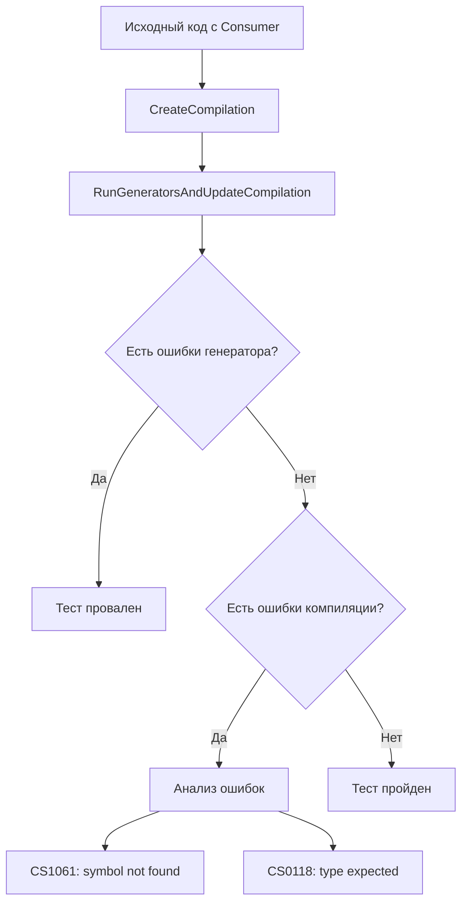

# Анализ и редизайн тестов PropertyNameResolver

## 1. Анализ текущих тестов

### 1.1 Что тестируется

Файл [`PropertyNameResolverTests.cs`](../tests/SingletonDI.Tests/PropertyNameResolverTests.cs) содержит 10 тестов для проверки корректности генерации имён свойств в контейнере DI:

| # | Тест | Сценарий |
|---|------|----------|
| 1 | `TwoProvidersWithSameShortName_NoCustomNames_GeneratesNamesWithNamespacePrefix` | Два провайдера с одинаковым ShortName без кастомных имён |
| 2 | `TwoProvidersWithSameShortName_OneCustomName_GeneratesCorrectNames` | Два провайдера, один с кастомным именем |
| 3 | `SingleProvider_NoConflict_UsesShortName` | Одиночный провайдер без конфликта |
| 4 | `SingleProvider_WithCustomName_UsesCustomName` | Одиночный провайдер с кастомным именем |
| 5 | `ThreeProvidersWithSameShortName_NoCustomNames_AllGetNamespacePrefix` | Три провайдера с одинаковым ShortName |
| 6 | `ThreeProviders_TwoWithCustomNames_OneWithout_GeneratesCorrectNames` | Три провайдера, два с кастомными именами |
| 7 | `Provider_InGlobalNamespace_UsesShortName` | Провайдер в global namespace |
| 8 | `Provider_WithNestedNamespace_GeneratesCorrectPrefix` | Провайдер с вложенным namespace |
| 9 | `MixedProviders_WithAndWithoutConflicts_GeneratesCorrectNames` | Смешанный сценарий |
| 10 | `ProviderWithCustomName_MatchesOtherProviderShortName_NoConflict` | Кастомное имя совпадает с ShortName другого |

### 1.2 Почему текущие тесты нестабильны

Текущие тесты используют **проверку строк в сгенерированном коде**:

```csharp
// Пример из теста
var generatedCode = RunGeneratorAndGetGeneratedCode(SOURCE);
Assert.Contains("SampleNamespace0_ProvideA", generatedCode);
Assert.Contains("SampleNamespace1_ProvideA", generatedCode);
```

**Проблемы этого подхода:**

1. **Хрупкость к изменениям форматирования** — любое изменение в генераторе (добавление пробелов, переносов строк, изменение порядка членов) сломает тесты

2. **Проверка реализации, а не поведения** — тесты проверяют HOW код сгенерирован, а не THAT он работает

3. **Ложные срабатывания** — строка может появиться в коде случайно (в комментарии, в другом контексте)

4. **Неполная проверка** — наличие строки не гарантирует, что:
   - Свойство имеет правильный тип
   - Свойство доступно для чтения
   - Свойство возвращает правильный экземпляр

5. **Сложность поддержки** — при рефакторинге генератора нужно обновлять все строковые проверки

---

## 2. Анализ подхода в DiagnosticErrorTests.cs

### 2.1 Метод компиляции

Файл [`DiagnosticErrorTests.cs`](../tests/SingletonDI.Tests/DiagnosticErrorTests.cs) использует подход компиляции исходного кода:

```csharp
private static ImmutableArray<Diagnostic> RunGenerator(string source)
{
    var compilation = CreateCompilation(source);
    var generator = new SingletonDIGenerator();
    var driver = CSharpGeneratorDriver.Create(generator);
    driver.RunGeneratorsAndUpdateCompilation(compilation, out _, out var diagnostics);
    return diagnostics;
}

private static CSharpCompilation CreateCompilation(string source)
{
    var references = new List<MetadataReference>
    {
        MetadataReference.CreateFromFile(typeof(object).Assembly.Location),
        MetadataReference.CreateFromFile(typeof(Task).Assembly.Location),
        MetadataReference.CreateFromFile(typeof(Attributes.SingletonDIProvideAttribute).Assembly.Location),
    };
    // ... добавление системных референсов
    
    return CSharpCompilation.Create(
        "TestAssembly",
        [CSharpSyntaxTree.ParseText(source)],
        references,
        new CSharpCompilationOptions(OutputKind.DynamicallyLinkedLibrary));
}
```

### 2.2 Ключевое отличие

`DiagnosticErrorTests` проверяет **диагностики компиляции**, но не проверяет успешность компиляции сгенерированного кода.

---

## 3. Новая архитектура тестов

### 3.1 Основная идея

Вместо проверки строк в сгенерированном коде, тесты должны **компилировать исходный код, который использует сгенерированные свойства**:

```csharp
// Исходный код для теста
const string SOURCE = """
    using SingletonDI.Attributes;
    
    namespace SampleNamespace0
    {
        [SingletonDIProvide]
        public class ProvideA { }
    }
    
    namespace SampleNamespace1
    {
        [SingletonDIProvide]
        public class ProvideA { }
    }
    
    namespace TestNamespace
    {
        [SingletonDIConsume(typeof(SampleNamespace0.ProvideA), typeof(SampleNamespace1.ProvideA))]
        public partial class Test
        {
            public void UseProviders()
            {
                // Если эти строки компилируются — свойства существуют и имеют правильные имена
                _ = SampleNamespace0_ProvideAInstance;
                _ = SampleNamespace1_ProvideAInstance;
            }
        }
    }
    """;

// Act
var compilation = CreateCompilation(SOURCE);
var generator = new SingletonDIGenerator();
var driver = CSharpGeneratorDriver.Create(generator);
driver.RunGeneratorsAndUpdateCompilation(compilation, out var outputCompilation, out var diagnostics);

// Assert — нет ошибок компиляции
Assert.Empty(outputCompilation.GetDiagnostics().Where(d => d.Severity == DiagnosticSeverity.Error));
```

### 3.2 Преимущества нового подхода

| Критерий | Старый подход | Новый подход |
|----------|---------------|--------------|
| Проверяет поведение | ❌ | ✅ |
| Устойчив к рефакторингу генератора | ❌ | ✅ |
| Проверяет типы свойств | ❌ | ✅ |
| Ложные срабатывания | Возможны | Исключены |
| Сложность поддержки | Высокая | Низкая |

### 3.3 Архитектура тестового фреймворка



---

## 4. Детальный план реализации

### 4.1 Вспомогательные методы

```csharp
/// <summary>
/// Запускает генератор и проверяет, что выходная компиляция не содержит ошибок.
/// </summary>
private static void AssertCompilesSuccessfully(string source)
{
    var compilation = CreateCompilation(source);
    var generator = new SingletonDIGenerator();
    var driver = CSharpGeneratorDriver.Create(generator);
    
    driver.RunGeneratorsAndUpdateCompilation(compilation, out var outputCompilation, out var generatorDiagnostics);
    
    // Проверяем, что генератор не выдал ошибок
    Assert.Empty(generatorDiagnostics.Where(d => d.Severity == DiagnosticSeverity.Error));
    
    // Проверяем, что выходная компиляция успешна
    var compilationErrors = outputCompilation.GetDiagnostics()
        .Where(d => d.Severity == DiagnosticSeverity.Error)
        .ToList();
    
    Assert.Empty(compilationErrors);
}

/// <summary>
/// Проверяет, что компиляция завершается с конкретной ошибкой CSxxxx.
/// </summary>
private static void AssertCompilationError(string source, string expectedErrorCode, string expectedSymbol)
{
    var compilation = CreateCompilation(source);
    var generator = new SingletonDIGenerator();
    var driver = CSharpGeneratorDriver.Create(generator);
    
    driver.RunGeneratorsAndUpdateCompilation(compilation, out var outputCompilation, out _);
    
    var errors = outputCompilation.GetDiagnostics()
        .Where(d => d.Severity == DiagnosticSeverity.Error)
        .ToList();
    
    Assert.NotEmpty(errors);
    Assert.Contains(errors, e => e.Id == expectedErrorCode && e.GetMessage().Contains(expectedSymbol));
}
```

### 4.2 Шаблон теста

```csharp
[Fact]
public void TwoProvidersWithSameShortName_GeneratesNamespacedProperties()
{
    const string SOURCE = """
        using SingletonDI.Attributes;
        
        namespace SampleNamespace0
        {
            [SingletonDIProvide]
            public class ProvideA { }
        }
        
        namespace SampleNamespace1
        {
            [SingletonDIProvide]
            public class ProvideA { }
        }
        
        namespace TestNamespace
        {
            [SingletonDIConsume(typeof(SampleNamespace0.ProvideA), typeof(SampleNamespace1.ProvideA))]
            public partial class Test
            {
                public void VerifyProperties()
                {
                    // Эти строки докажут, что свойства существуют с правильными именами
                    SampleNamespace0.ProvideA provider0 = SampleNamespace0_ProvideAInstance;
                    SampleNamespace1.ProvideA provider1 = SampleNamespace1_ProvideAInstance;
                }
            }
        }
        """;
    
    AssertCompilesSuccessfully(SOURCE);
}
```

---

## 5. Список тест-кейсов для реализации

### 5.1 Базовые сценарии

| ID | Тест-кейс | Ожидаемое имя свойства | Примечание |
|----|-----------|------------------------|------------|
| TC01 | Одиночный провайдер без конфликта | `{ShortName}Instance` | `MyServiceInstance` |
| TC02 | Одиночный провайдер с кастомным именем | `{CustomName}` | Без суффикса Instance |
| TC03 | Провайдер в global namespace | `{ShortName}Instance` | Без namespace префикса |

### 5.2 Конфликты ShortName

| ID | Тест-кейс | Ожидаемые имена | Примечание |
|----|-----------|-----------------|------------|
| TC04 | Два провайдера с одинаковым ShortName | `{Namespace}_{ShortName}Instance` | Оба с префиксом |
| TC05 | Три провайдера с одинаковым ShortName | `{Namespace}_{ShortName}Instance` | Все три с префиксом |
| TC06 | Вложенные namespace при конфликте | `{Nested_Namespace}_{ShortName}Instance` | Точки заменяются на _ |

### 5.3 Смешанные сценарии

| ID | Тест-кейс | Ожидаемое поведение |
|----|-----------|---------------------|
| TC07 | Два провайдера, один с кастомным именем | Кастомное имя используется как есть, второй получает `{ShortName}Instance` |
| TC08 | Три провайдера, два с кастомными именами | Кастомные используются, третий получает `{ShortName}Instance` |
| TC09 | Смешанные: один без конфликта, два с конфликтом | Без конфликта — `{ShortName}Instance`, с конфликтом — с префиксом |

### 5.4 Граничные случаи

| ID | Тест-кейс | Ожидаемое поведение |
|----|-----------|---------------------|
| TC10 | Кастомное имя совпадает с ShortName другого провайдера | Не считается конфликтом |
| TC11 | Провайдер с generic-параметром | Корректная генерация имени |
| TC12 | Провайдер с вложенным классом | Корректная генерация имени |

### 5.5 Негативные тесты

| ID | Тест-кейс | Ожидаемая ошибка |
|----|-----------|------------------|
| TC13 | Consumer пытается использовать несуществующее свойство | CS1061 |
| TC14 | Consumer использует неправильное имя при конфликте | CS1061 |

---

## 6. Примеры кода для тестов

### TC01: Одиночный провайдер без конфликта

```csharp
[Fact]
public void SingleProvider_NoConflict_GeneratesShortNameProperty()
{
    const string SOURCE = """
        using SingletonDI.Attributes;
        
        namespace MyApp.Services
        {
            [SingletonDIProvide]
            public class MyService 
            { 
                public void DoWork() { }
            }
            
            [SingletonDIConsume(typeof(MyService))]
            public partial class Consumer
            {
                public void UseService()
                {
                    MyService service = MyServiceInstance;
                    service.DoWork();
                }
            }
        }
        """;
    
    AssertCompilesSuccessfully(SOURCE);
}
```

### TC04: Два провайдера с одинаковым ShortName

```csharp
[Fact]
public void TwoProviders_SameShortName_GeneratesNamespacedProperties()
{
    const string SOURCE = """
        using SingletonDI.Attributes;
        
        namespace NamespaceA
        {
            [SingletonDIProvide]
            public class Service { }
        }
        
        namespace NamespaceB
        {
            [SingletonDIProvide]
            public class Service { }
        }
        
        namespace ConsumerNamespace
        {
            [SingletonDIConsume(typeof(NamespaceA.Service), typeof(NamespaceB.Service))]
            public partial class Consumer
            {
                public void UseServices()
                {
                    NamespaceA.Service a = NamespaceA_ServiceInstance;
                    NamespaceB.Service b = NamespaceB_ServiceInstance;
                }
            }
        }
        """;
    
    AssertCompilesSuccessfully(SOURCE);
}
```

### TC07: Два провайдера, один с кастомным именем

```csharp
[Fact]
public void TwoProviders_OneWithCustomName_GeneratesCorrectProperties()
{
    const string SOURCE = """
        using SingletonDI.Attributes;
        
        namespace NamespaceA
        {
            [SingletonDIProvide("CustomService")]
            public class Service { }
        }
        
        namespace NamespaceB
        {
            [SingletonDIProvide]
            public class Service { }
        }
        
        namespace ConsumerNamespace
        {
            [SingletonDIConsume(typeof(NamespaceA.Service), typeof(NamespaceB.Service))]
            public partial class Consumer
            {
                public void UseServices()
                {
                    NamespaceA.Service custom = CustomService;
                    NamespaceB.Service regular = ServiceInstance;
                }
            }
        }
        """;
    
    AssertCompilesSuccessfully(SOURCE);
}
```

### TC13: Негативный тест — неправильное имя свойства

```csharp
[Fact]
public void Consumer_UsesWrongPropertyName_FailsToCompile()
{
    const string SOURCE = """
        using SingletonDI.Attributes;
        
        namespace NamespaceA
        {
            [SingletonDIProvide]
            public class Service { }
        }
        
        namespace NamespaceB
        {
            [SingletonDIProvide]
            public class Service { }
        }
        
        namespace ConsumerNamespace
        {
            [SingletonDIConsume(typeof(NamespaceA.Service), typeof(NamespaceB.Service))]
            public partial class Consumer
            {
                public void UseServices()
                {
                    // Ошибка: при конфликте имена должны быть с namespace префиксом
                    _ = ServiceInstance; // Этого свойства не должно быть!
                }
            }
        }
        """;
    
    AssertCompilationError(SOURCE, "CS1061", "ServiceInstance");
}
```

---

## 7. Рекомендации по реализации

### 7.1 Структура файла

```
tests/SingletonDI.Tests/
├── PropertyNameResolverTests.cs      # Новые тесты (компиляция)
├── PropertyNameResolverTests.Legacy.cs # Старые тесты (для справки, удалить после)
└── TestHelpers/
    └── CompilationTestHelper.cs       # Общие методы для компиляции
```

### 7.2 Порядок реализации

1. Создать `CompilationTestHelper.cs` с методами `AssertCompilesSuccessfully` и `AssertCompilationError`
2. Реализовать TC01-TC03 (базовые сценарии)
3. Реализовать TC04-TC06 (конфликты)
4. Реализовать TC07-TC09 (смешанные сценарии)
5. Реализовать TC10-TC12 (граничные случаи)
6. Реализовать TC13-TC14 (негативные тесты)
7. Удалить старые тесты после успешного прохождения новых

### 7.3 Улучшения

- Добавить XML-документацию для всех тестов
- Использовать `[Trait("Category", "PropertyNameResolution")]` для группировки
- Добавить параметризованные тесты через `[Theory]` и `[InlineData]` где уместно

---

## 8. Заключение

Новая архитектура тестов основана на **компиляции исходного кода**, который использует сгенерированные свойства. Это обеспечивает:

1. **Надёжность** — тесты проверяют реальное поведение
2. **Устойчивость к рефакторингу** — изменения в генераторе не ломают тесты
3. **Полноту проверки** — проверяются типы, доступность, корректность имён
4. **Простоту поддержки** — тесты понятны и легко расширяются
