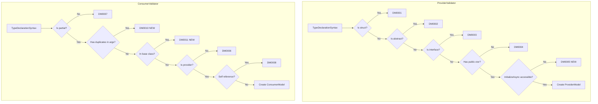

# Проектирование валидации для SingletonDI Source Generator

## Анализ текущей структуры валидаторов

### Существующая архитектура

Проект использует паттерн **Incremental Source Generator** с разделением на следующие компоненты:

```
SingletonDI.Generator/
├── DiagnosticDescriptors.cs    # Централизованные дескрипторы диагностик (DM0001-DM0009)
├── SingletonDIGenerator.cs     # Точка входа генератора
├── Models/
│   ├── ProviderModel.cs        # Модель провайдера (immutable record struct)
│   └── ConsumerModel.cs        # Модель потребителя (immutable record struct)
└── Validators/
    ├── ProviderValidator.cs    # Валидация [SingletonDIProvide]
    └── ConsumerValidator.cs    # Валидация [SingletonDIConsume]
```

### Текущие коды диагностик

| Код    | Описание                                    | Файл                |
|--------|---------------------------------------------|---------------------|
| DM0001 | [Provide] на struct/record struct           | ProviderValidator   |
| DM0002 | [Provide] на abstract class                 | ProviderValidator   |
| DM0003 | [Provide] на interface                      | ProviderValidator   |
| DM0004 | Отсутствует public parameterless constructor| ProviderValidator   |
| DM0006 | [Consume] ссылается на non-provider         | ConsumerValidator   |
| DM0007 | Consumer не объявлен как partial            | ConsumerValidator   |
| DM0008 | Consumer ссылается на самого себя           | ConsumerValidator   |
| DM0009 | Циклическая зависимость                     | TopologicalSorter   |

**Примечание:** DM0005 пропущен в нумерации — можно использовать для новой диагностики.

---

## Задача 1: Валидация модификаторов доступа InitializeAsync

### Проблема

Метод `InitializeAsync()` вызывается из сгенерированного кода Container. Если метод имеет ограниченный модификатор доступа, вызов будет невозможен.

### Анализ

Текущая реализация в [`ProviderValidator.HasInitializeAsyncMethod()`](src/SingletonDI.Generator/Validators/ProviderValidator.cs:90) проверяет только сигнатуру метода, но не модификатор доступа:

```csharp
private static bool HasInitializeAsyncMethod(INamedTypeSymbol typeSymbol)
{
    foreach (var member in typeSymbol.GetMembers())
    {
        if (member is IMethodSymbol method &&
            method.Name == "InitializeAsync" &&
            method.Parameters.IsEmpty &&
            method.ReturnType != null)
        {
            var returnTypeName = method.ReturnType.ToDisplayString();
            if (returnTypeName == "System.Threading.Tasks.Task" ||
                returnTypeName == "Task")
            {
                return true;  // Не проверяется модификатор доступа!
            }
        }
    }
    return false;
}
```

### Допустимые и недопустимые модификаторы

| Модификатор        | Допустим | Причина                                              |
|--------------------|----------|------------------------------------------------------|
| `public`           | ✅       | Доступен отовсюду                                    |
| `internal`         | ✅       | Доступен в рамках assembly                           |
| `protected internal`| ✅      | Доступен в derived classes и в той же assembly       |
| `protected`        | ❌       | Только в derived classes — генератор не наследует    |
| `private`          | ❌       | Недоступен извне                                     |
| `private protected`| ❌       | Недоступен извне                                     |

### Предлагаемый DiagnosticDescriptor

```csharp
/// <summary>
/// DM0005: InitializeAsync method has inaccessible access modifier.
/// </summary>
public static readonly DiagnosticDescriptor InitializeAsyncNotAccessible = Create(
    "DM0005",
    "InitializeAsync method is not accessible",
    "InitializeAsync method in class '{0}' has '{1}' access modifier. " +
    "The method must be public or internal to be callable from generated code.",
    Category,
    DiagnosticSeverity.Error);
```

### План реализации

1. **Модификация [`ProviderValidator.cs`](src/SingletonDI.Generator/Validators/ProviderValidator.cs)**:
   - Изменить метод `HasInitializeAsyncMethod()` на `ValidateInitializeAsyncMethod()` возвращающий `(bool HasMethod, bool IsAccessible, Accessibility? Accessibility)`
   - Добавить проверку `method.DeclaredAccessibility`
   - Добавить выдачу диагностики DM0005 в метод `Validate()`

2. **Логика проверки**:
   ```csharp
   private static readonly Accessibility[] AllowedAccessibilities = 
   {
       Accessibility.Public,
       Accessibility.Internal,
       Accessibility.ProtectedOrInternal  // protected internal
   };
   
   private static (bool HasMethod, bool IsAccessible, Accessibility? Accessibility) 
       ValidateInitializeAsyncMethod(INamedTypeSymbol typeSymbol)
   {
       foreach (var member in typeSymbol.GetMembers())
       {
           if (member is IMethodSymbol method &&
               method.Name == "InitializeAsync" &&
               method.Parameters.IsEmpty)
           {
               var returnTypeName = method.ReturnType.ToDisplayString();
               if (returnTypeName == "System.Threading.Tasks.Task" ||
                   returnTypeName == "Task")
               {
                   var isAccessible = AllowedAccessibilities.Contains(method.DeclaredAccessibility);
                   return (true, isAccessible, method.DeclaredAccessibility);
               }
           }
       }
       return (false, true, null); // Метод отсутствует — это допустимо
   }
   ```

3. **Location диагностики**: Использовать `method.Locations[0]` для точного указания на метод.

---

## Задача 2: Дубликаты типов в аргументах [SingletonDIConsume]

### Проблема

Атрибут `[SingletonDIConsume(typeof(A), typeof(B), typeof(C), typeof(C))]` содержит дубликат типа C. Это приведёт к генерации дублирующихся свойств.

### Предлагаемый DiagnosticDescriptor

```csharp
/// <summary>
/// DM0010: Duplicate types in [SingletonDIConsume] attribute arguments.
/// </summary>
public static readonly DiagnosticDescriptor ConsumeDuplicateTypes = Create(
    "DM0010",
    "Duplicate types in dependencies",
    "[SingletonDIConsume] contains duplicate type '{0}'. Each dependency type must be specified only once.",
    Category,
    DiagnosticSeverity.Error);
```

### План реализации

1. **Модификация [`ConsumerValidator.cs`](src/SingletonDI.Generator/Validators/ConsumerValidator.cs)**:
   - После извлечения `dependencyTypes` (строка 45-67) добавить проверку на дубликаты
   - Использовать `HashSet<ITypeSymbol>` с кастомным `IEqualityComparer` по FQN

2. **Логика проверки**:
   ```csharp
   // После извлечения dependencyTypes
   var seenTypes = new HashSet<string>();
   foreach (var depType in dependencyTypes)
   {
       var depFqn = depType.ToDisplayString(SymbolDisplayFormat.FullyQualifiedFormat);
       if (!seenTypes.Add(depFqn))
       {
           // Дубликат найден
           reportDiagnostic(Diagnostic.Create(
               DiagnosticDescriptors.ConsumeDuplicateTypes,
               typeDecl.Identifier.GetLocation(),  // или Location атрибута
               depType.Name));
       }
   }
   ```

3. **Location диагностики**: Location конкретного аргумента атрибута (typeof(C))
   - Требует доступа к `AttributeData.ApplicationSyntaxReference` для получения синтаксиса

4. **Стратегия**: Выдавать по одной ошибке на каждый дубликат

5. **Получение location аргумента атрибута**:
   ```csharp
   // В атрибуте [SingletonDIConsume(typeof(A), typeof(B), typeof(A))]
   // Нужно получить location второго typeof(A)
   
   private static Location? GetTypeArgumentLocation(
       AttributeData attributeData,
       int argumentIndex)
   {
       var attributeSyntax = attributeData.ApplicationSyntaxReference?.GetSyntax();
       if (attributeSyntax is AttributeSyntax attrSyntax)
       {
           var args = attrSyntax.ArgumentList?.Arguments;
           if (args != null && args.Value.Count > argumentIndex)
           {
               return args.Value[argumentIndex].GetLocation();
           }
       }
       return null;
   }
   ```

---

## Задача 3: Дубликаты в родительских классах и интерфейсах

### Проблема

Атрибут `[SingletonDIConsume]` наследуется (`Inherited = true`). Если родитель уже объявил зависимость, потомок не должен её дублировать.

```csharp
[SingletonDIConsume(typeof(IService))]
public class BaseController { }

[SingletonDIConsume(typeof(IService))]  // Ошибка!
public class ChildController : BaseController { }
```

### Предлагаемый DiagnosticDescriptor

```csharp
/// <summary>
/// DM0011: Dependency already declared in base class.
/// </summary>
public static readonly DiagnosticDescriptor ConsumeDuplicateInBaseClass = Create(
    "DM0011",
    "Dependency already declared in base class",
    "[SingletonDIConsume] type '{0}' is already declared in base class '{1}'. " +
    "Remove the duplicate dependency or use a different type.",
    Category,
    DiagnosticSeverity.Error);
```

### План реализации

1. **Модификация [`ConsumerValidator.cs`](src/SingletonDI.Generator/Validators/ConsumerValidator.cs)**:
   - Добавить метод `GetInheritedDependencies(INamedTypeSymbol typeSymbol)`
   - Пройти по иерархии наследования (классы + интерфейсы) и собрать все зависимости

2. **Логика проверки (классы + интерфейсы)**:
   ```csharp
   private static HashSet<string> GetInheritedDependencies(INamedTypeSymbol typeSymbol)
   {
       var inherited = new HashSet<string>();
       
       // 1. Обход базовых классов
       var baseType = typeSymbol.BaseType;
       while (baseType != null)
       {
           AddDependenciesFromAttribute(baseType, inherited);
           baseType = baseType.BaseType;
       }
       
       // 2. Обход интерфейсов
       foreach (var iface in typeSymbol.AllInterfaces)
       {
           AddDependenciesFromAttribute(iface, inherited);
       }
       
       return inherited;
   }
   
   private static void AddDependenciesFromAttribute(INamedTypeSymbol type, HashSet<string> target)
   {
       var consumeAttr = type.GetAttributes()
           .FirstOrDefault(a => a.AttributeClass?.ToDisplayString() 
               == "SingletonDI.Attributes.SingletonDIConsumeAttribute");
       
       if (consumeAttr == null) return;
       
       // Извлечь типы из атрибута
       if (consumeAttr.ConstructorArguments.Length > 0)
       {
           var firstArg = consumeAttr.ConstructorArguments[0];
           if (firstArg.Kind == TypedConstantKind.Array)
           {
               foreach (var element in firstArg.Values)
               {
                   if (element.Kind == TypedConstantKind.Type && element.Value is ITypeSymbol depType)
                   {
                       var fqn = depType.ToDisplayString(SymbolDisplayFormat.FullyQualifiedFormat);
                       target.Add(fqn);
                   }
               }
           }
           else if (firstArg.Kind == TypedConstantKind.Type && firstArg.Value is ITypeSymbol singleType)
           {
               var fqn = singleType.ToDisplayString(SymbolDisplayFormat.FullyQualifiedFormat);
               target.Add(fqn);
           }
       }
   }
   ```

3. **Интеграция в `Validate()`**:
   ```csharp
   var inheritedDependencies = GetInheritedDependencies(typeSymbol);
   
   foreach (var depType in dependencyTypes)
   {
       var depFqn = depType.ToDisplayString(SymbolDisplayFormat.FullyQualifiedFormat);
       
       if (inheritedDependencies.Contains(depFqn))
       {
           reportDiagnostic(Diagnostic.Create(
               DiagnosticDescriptors.ConsumeDuplicateInBaseClass,
               typeDecl.Identifier.GetLocation(),
               depType.Name,
               typeSymbol.BaseType?.Name ?? "unknown"));
           continue;
       }
       
       // Остальные проверки...
   }
   ```

4. **Особенность**: Атрибут `[SingletonDIConsume]` имеет `Inherited = true`, поэтому генератор уже учитывает наследование. Данная проверка предотвращает явное дублирование.

---

## Сводная таблица новых диагностик

| Код    | Название                          | Severity | Файл             |
|--------|-----------------------------------|----------|------------------|
| DM0005 | InitializeAsyncNotAccessible      | Error    | ProviderValidator|
| DM0010 | ConsumeDuplicateTypes             | Error    | ConsumerValidator|
| DM0011 | ConsumeDuplicateInBaseClass       | Error    | ConsumerValidator|

---

## Диаграмма потока валидации



---

## Порядок реализации

1. **Задача 1** (InitializeAsync accessibility) — простая, локальная в ProviderValidator
2. **Задача 2** (Duplicate types in args) — простая, локальная в ConsumerValidator
3. **Задача 3** (Duplicate in base class) — требует обхода иерархии наследования

---

## Принятые решения

| Вопрос | Решение |
|--------|---------|
| Location для DM0010 | На конкретном аргументе атрибута (typeof(C)) |
| Множественные дубликаты | По одной ошибке на каждый дубликат |
| Интерфейсы в иерархии | Проверять интерфейсы через `typeSymbol.AllInterfaces` |

---

## Todo List для реализации

- [ ] **DiagnosticDescriptors.cs**: Добавить DM0005, DM0010, DM0011
- [ ] **ProviderValidator.cs**: Добавить валидацию модификатора доступа InitializeAsync
- [ ] **ConsumerValidator.cs**: Добавить проверку дубликатов в аргументах атрибута
- [ ] **ConsumerValidator.cs**: Добавить проверку дубликатов в базовых классах/интерфейсах
- [ ] **Tests**: Добавить unit-тесты для новых диагностик
